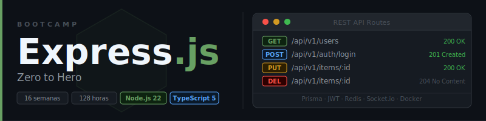

<p align="center">
  
</p>

<p align="center">
  <a href="LICENSE"></a>
  <a href="#"></a>
  <a href="#"></a>
  <a href="#"></a>
  <a href="#"></a>
</p>

<p align="center">
  <a href="README.md"></a>
</p>

---

## 📋 Description

Intensive **16-week (~4 months)** bootcamp focused on mastering **Express.js** and modern REST API development with Node.js. Designed to take developers with JavaScript/TypeScript experience to **Junior Backend Developer**, with emphasis on clean code, best practices, and production-ready APIs.

### 🎯 Objectives

Upon completion of the bootcamp, students will be able to:

- ✅ Master the Node.js runtime and the non-blocking I/O model
- ✅ Build HTTP servers with Express 5 and TypeScript from scratch
- ✅ Design REST APIs following best practices (versioning, status codes, contracts)
- ✅ Validate and sanitize input data with Zod
- ✅ Implement persistence with Prisma ORM + PostgreSQL and Mongoose + MongoDB
- ✅ Authenticate users with bcrypt, JWT (access/refresh tokens), and HttpOnly cookies
- ✅ Control access with RBAC (Role-Based Access Control)
- ✅ Apply OWASP security: Helmet, rate limiting, CORS, sanitization
- ✅ Write unit and integration tests with Jest + Supertest
- ✅ Manage file uploads with Multer and cloud storage (S3/Cloudinary)
- ✅ Implement real-time communication with Socket.io
- ✅ Use Redis for caching and session management
- ✅ Document APIs with OpenAPI/Swagger
- ✅ Dockerize applications and deploy them with CI/CD in production

### 🚀 Why Express with TypeScript?

> **Modern backend from day 1** — No legacy code, only current best practices.

Express is the most widely used HTTP framework in the Node.js ecosystem. This bootcamp focuses exclusively on Express 5 and Node.js 22+, with TypeScript from day one. Students learn directly the tools and techniques they will use in the professional world.

---

## 🗓️ Bootcamp Structure

|        Stage        | Weeks | Hours | Main Topics                                              |
| :-----------------: | :---: | :---: | -------------------------------------------------------- |
| **Fundamentals**    |  1-2  |  16h  | Node.js runtime, TypeScript, basic Express, middleware   |
| **Core API**        |  3-8  |  48h  | REST, Zod, Prisma, MongoDB, JWT auth, RBAC, security     |
| **Advanced**        | 9-13  |  40h  | Testing, uploads, WebSockets, Redis, OpenAPI/Swagger     |
| **Production**      | 14-16 |  24h  | Docker, CI/CD, deployment, final project                 |

**Total: 16 weeks** | **128 hours** of intensive training

---

## 📚 Weekly Content

Each week includes:

```
bootcamp/week-XX-topic/
├── README.md                 # Description and objectives
├── rubrica-evaluacion.md     # Evaluation criteria
├── 0-assets/                 # Images and diagrams
├── 1-teoria/                 # Theoretical material
├── 2-practicas/              # Guided exercises
├── 3-proyecto/               # Weekly project
├── 4-recursos/               # Additional resources
│   ├── ebooks-free/
│   ├── videografia/
│   └── webgrafia/
└── 5-glosario/               # Key terms
```

| Week | Topic | Description |
|------|-------|-------------|
| 01 | `nodejs_fundamentals` | Node.js runtime, ESM modules, async/await, TypeScript config |
| 02 | `express_intro` | HTTP server, routing, middleware, req/res lifecycle |
| 03 | `rest_api_arquitectura` | Layered architecture routes/controllers/services, HTTP status codes, REST |
| 04 | `validacion_error_handling` | Zod, global error middleware, logging with Winston |
| 05 | `postgresql_prisma` | PostgreSQL + Prisma ORM, migrations, relations |
| 06 | `mongodb_mongoose` | MongoDB + Mongoose, comparison, use cases |
| 07 | `autenticacion_jwt` | bcrypt, JWT access/refresh tokens, HttpOnly cookies |
| 08 | `autorizacion_seguridad` | RBAC, Helmet, rate limiting, CORS, sanitization |
| 09 | `testing` | Jest + Supertest, unit/integration, mocks, coverage |
| 10 | `uploads_emails` | Multer, S3/Cloudinary, Nodemailer |
| 11 | `websockets` | Socket.io, rooms, WS authentication, real-time patterns |
| 12 | `caching_performance` | Redis, efficient pagination, compression |
| 13 | `openapi_swagger` | OpenAPI/Swagger, versioning, API contracts |
| 14 | `docker` | Multi-stage Dockerfile, docker-compose, secrets |
| 15 | `cicd_deployment` | GitHub Actions, Railway/Render, monitoring |
| 16 | `proyecto_final` | Complete architecture, code review, presentation |

### 🔑 Key Components

- 📖 **Theory**: Fundamental concepts with real-world examples
- 💻 **Practice**: Progressive exercises and hands-on projects
- 📝 **Evaluation**: Knowledge, performance, and product evidence
- 🎓 **Resources**: Glossaries, references, and supplementary material

---

## 🛠️ Tech Stack

| Technology      | Version   | Usage                          |
| --------------- | --------- | ------------------------------ |
| Node.js         | **22+**   | Runtime                        |
| Express         | **5.x**   | HTTP framework                 |
| TypeScript      | **5.x**   | Main language                  |
| Prisma ORM      | **6.x**   | Relational database ORM        |
| PostgreSQL      | **16+**   | Relational database            |
| Mongoose        | **8.x**   | NoSQL database ODM             |
| MongoDB         | **7+**    | NoSQL database                 |
| Zod             | **3.x**   | Schema validation              |
| bcrypt          | **5.x**   | Password hashing               |
| JSON Web Token  | **9.x**   | Authentication                 |
| Jest            | **29.x**  | Unit and integration testing   |
| Supertest       | **7.x**   | HTTP endpoint testing          |
| Socket.io       | **4.x**   | Real-time WebSockets           |
| Redis (ioredis) | **5.x**   | Caching and sessions           |
| Multer          | **2.x**   | File uploads                   |
| Winston         | **3.x**   | Logging                        |
| Swagger UI      | **5.x**   | API documentation              |
| Docker          | **26+**   | Containers                     |
| pnpm            | **10.x**  | Package management             |

**Development environment**: VS Code + Thunder Client / Postman  
**Deployment**: Railway / Render via GitHub Actions

---

## 🚀 Quick Start

### Prerequisites

- **Node.js 22+** installed
- **pnpm** as package manager (`npm install -g pnpm`)
- **Docker** (recommended for PostgreSQL + Redis)
- **Git** for version control
- **VS Code** (recommended) with included extensions
- **Thunder Client** or **Postman** to test API endpoints

### 1. Clone the Repository

```bash
git clone https://github.com/ergrato-dev/bc-expressjs.git
cd bc-expressjs
```

### 2. Start the Database Services

```bash
# Start PostgreSQL + Redis with Docker
docker compose up -d
```

### 3. Install VS Code Extensions

```bash
# Open in VS Code
code .

# Recommended extensions will appear automatically
# Or run: Ctrl+Shift+P → "Extensions: Show Recommended Extensions"
```

### 4. Navigate to the Current Week

```bash
cd bootcamp/week-01-nodejs_fundamentals/2-practicas/ejercicio-01/starter
pnpm install
pnpm dev
```

### 5. Follow the Instructions

Each week contains a `README.md` with detailed step-by-step instructions.

---

## 📊 Learning Methodology

### Teaching Strategies

- 🎯 **Project-Based Learning (PBL)**
- 🏛️ **Unique Domains**: Each learner applies concepts to their assigned domain (anti-copy policy)
- 🧩 **Deliberate Practice**
- 🔌 **API-First Thinking**: Always think in contracts, status codes, and consumers
- 👥 **Peer Code Review**
- 🎮 **Live Coding**

### Time Distribution (8h/week)

- **Theory**: 2 hours
- **Practice**: 3-4 hours
- **Project**: 2-3 hours

### Evaluation

Each week includes three types of evidence:

1. **Knowledge 🧠** (30%): Theoretical assessments and quizzes
2. **Performance 💪** (40%): Practical exercises in class
3. **Product 📦** (30%): Evaluable deliverables (functional projects)

**Passing criteria**: Minimum 70% in each type of evidence. Coherent implementation consistent with the assigned domain. Originality: no copying among learners.

---

## 🏛️ Unique Domains Policy (Anti-Copy)

Each learner receives a **unique domain assigned by the instructor** from the first class, used across all bootcamp projects.

Domain examples: 📖 Library, 💊 Pharmacy, 🏋️ Gym, 🏫 School, 🏬 Pet Store, 🍽️ Restaurant, 🏦 Bank, 🚕 Taxi Agency, 🏥 Hospital, 🎥 Cinema, 🏞️ Hotel, ✈️ Travel Agency, 🏎️ Car Dealership, 👗 Clothing Store, 🛠️ Auto Repair Shop, and more.

**Objective:**

- ✅ Prevent copying between students
- ✅ Encourage original implementations
- ✅ Apply general concepts to specific contexts
- ✅ Develop abstraction and adaptation skills

**Instructor responsibilities:**

1. Assign a unique domain to each learner at the start
2. Maintain a record of assigned domains
3. Do not repeat domains within the same group
4. Validate domain coherence during evaluations

---

## 📞 Support

- 💬 **Discussions**: [GitHub Discussions](https://github.com/ergrato-dev/bc-expressjs/discussions)
- 🐛 **Issues**: [GitHub Issues](https://github.com/ergrato-dev/bc-expressjs/issues)

---

## ⚠️ Disclaimer

This repository is an **educational** resource created for learning purposes. By using it, you agree to the following terms:

- **Educational purposes only**: The content, code examples, and projects are designed exclusively for teaching and learning. They do not constitute professional, legal, or security advice.
- **No warranties**: The material is provided **"as is"**, without warranties of any kind, express or implied, including fitness for a particular purpose or freedom from errors.
- **Production code**: Code examples are illustrative. Before using them in production environments, you must perform security, performance, and context-specific reviews.
- **Software versions**: Library and tool versions mentioned may become outdated. Always consult the latest official documentation.
- **Limitation of liability**: The authors and contributors are not responsible for data loss, direct or indirect damages, service interruptions, or any other harm arising from the use of this material.
- **Student responsibility**: Each student is responsible for their own implementations, development environments, and technical decisions.

---

## 📄 License

This project is licensed under **[CC BY-NC-SA 4.0](https://creativecommons.org/licenses/by-nc-sa/4.0/)** (Creative Commons Attribution-NonCommercial-ShareAlike 4.0 International).

**You may:** share and adapt the material, including creating educational forks.<br>
**You may not:** use this material for commercial purposes.<br>
**You must:** give appropriate credit and distribute adaptations under the same license.

See the [LICENSE](LICENSE) file for the full text.

---

## 🏆 Acknowledgments

- [Node.js](https://nodejs.org/) — For the cross-platform server-side runtime
- [Express](https://expressjs.com/) — For the minimalist and powerful HTTP framework
- [Prisma](https://www.prisma.io/) — For the next-generation Node.js ORM
- [TypeScript](https://www.typescriptlang.org/) — For bringing type safety to JavaScript
- Node.js Community — For the rich ecosystem of packages and resources
- All contributors

---

## 📚 Additional Documentation

- [🤖 Copilot Instructions](.github/copilot-instructions.md)

---

<p align="center">
  <strong>🎓 ExpressJS Bootcamp - Zero to Hero</strong><br>
  <em>From JavaScript developer to backend developer in 4 months</em>
</p>

<p align="center">
  <a href="bootcamp/week-01">Start Week 1</a> •
  <a href="docs">View Docs</a> •
  <a href="https://github.com/ergrato-dev/bc-expressjs/issues">Report Issue</a>
</p>

<p align="center">
  Made with ❤️ for the developer community
</p>
