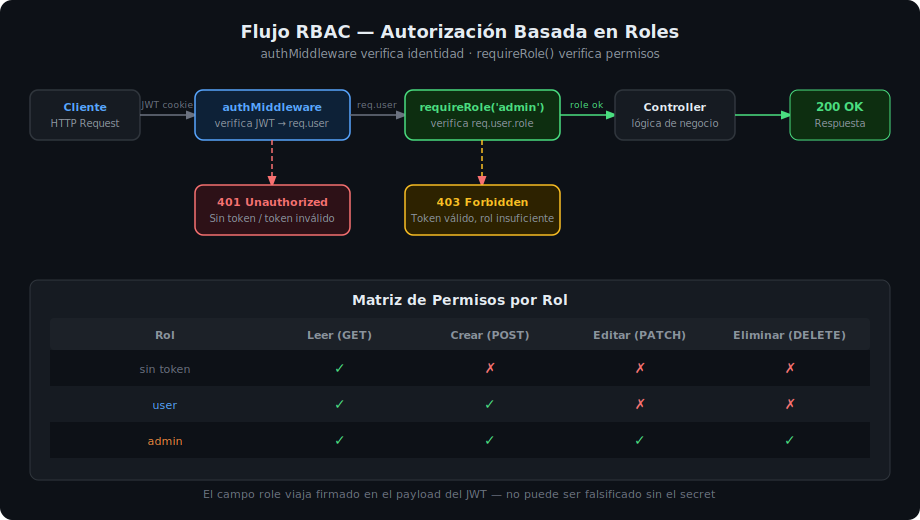

# 01 — RBAC: Autorización Basada en Roles

## 🎯 Objetivos

- Entender la diferencia entre autenticación y autorización
- Implementar `requireRole()` como middleware de Express
- Proteger rutas según el rol del usuario autenticado
- Usar el campo `role` del payload JWT para tomar decisiones de acceso



---

## 1. Autenticación vs Autorización

Son dos conceptos distintos que trabajan en secuencia:

| Concepto | Pregunta | Herramienta | Ejemplo |
|----------|----------|-------------|---------|
| **Autenticación** | ¿Quién eres? | JWT + bcrypt | Verificar email y contraseña |
| **Autorización** | ¿Qué puedes hacer? | RBAC + `requireRole` | Verificar que el usuario es `admin` |

En Express, el flujo es siempre:

```
Request → authMiddleware → requireRole() → controller
```

`authMiddleware` verifica que el token sea válido y popula `req.user`.  
`requireRole()` verifica que `req.user.role` cumpla el requisito de la ruta.

---

## 2. RBAC — Role-Based Access Control

RBAC asigna permisos a **roles**, no a usuarios individuales. Cada usuario tiene un rol, y cada rol tiene permisos sobre recursos.

```
Usuario → Rol → Permisos → Recursos
```

### Ejemplo de modelo de roles

| Rol | Puede leer | Puede crear | Puede editar | Puede eliminar |
|-----|-----------|-------------|--------------|----------------|
| `user` | ✅ | ❌ | ❌ | ❌ |
| `editor` | ✅ | ✅ | ✅ | ❌ |
| `admin` | ✅ | ✅ | ✅ | ✅ |

---

## 3. El campo `role` en el JWT

El rol viaja en el **payload del access token**, firmado con el secret del servidor. No se puede falsificar sin conocer el secret.

```typescript
// Al hacer login, incluir role en el payload
const accessToken = signAccessToken({
  sub: user._id.toString(),
  email: user.email,
  role: user.role, // 'user' | 'admin'
});
```

```typescript
// El middleware lo decodifica y lo deja disponible en req.user
req.user = {
  sub: '64a1b2c3...',
  email: 'juan@ejemplo.com',
  role: 'admin',
};
```

---

## 4. Implementar `requireRole()`

`requireRole()` es una **higher-order function**: recibe los roles permitidos y devuelve un middleware.

```typescript
// src/middlewares/requireRole.ts
import { Request, Response, NextFunction } from 'express';
import { AppError } from '../errors/AppError';

// Acepta uno o más roles permitidos
export function requireRole(...roles: string[]) {
  return (req: Request, _res: Response, next: NextFunction): void => {
    // authMiddleware ya debe haber corrido antes — req.user debe existir
    if (!req.user) {
      return next(new AppError(401, 'No autenticado'));
    }

    if (!roles.includes(req.user.role ?? '')) {
      return next(
        new AppError(403, 'No autorizado — permisos insuficientes')
      );
    }

    next();
  };
}
```

### Diferencia entre 401 y 403

| Código | Significado | Cuándo usarlo |
|--------|-------------|---------------|
| **401 Unauthorized** | Sin autenticación válida | No hay token, o token expirado |
| **403 Forbidden** | Autenticado pero sin permiso | Token válido, pero rol insuficiente |

---

## 5. Aplicar `requireRole()` en rutas

```typescript
// src/routes/admin.routes.ts
import { Router } from 'express';
import { authMiddleware } from '../middlewares/auth.middleware';
import { requireRole } from '../middlewares/requireRole';
import * as adminController from '../controllers/admin.controller';

const router = Router();

// Solo admins pueden acceder
router.get('/users', authMiddleware, requireRole('admin'), adminController.listUsers);
router.delete('/users/:id', authMiddleware, requireRole('admin'), adminController.deleteUser);

// Admins y editores pueden acceder
router.post('/posts', authMiddleware, requireRole('admin', 'editor'), adminController.createPost);

export default router;
```

Alternativa: aplicar auth y role a **todas las rutas del router**:

```typescript
// Proteger todo el router con auth + rol admin
router.use(authMiddleware);
router.use(requireRole('admin'));

router.get('/users', adminController.listUsers);
router.delete('/users/:id', adminController.deleteUser);
```

---

## 6. Usar `req.user.role` en controladores

En casos donde la lógica de negocio depende del rol (sin middleware dedicado):

```typescript
// Ejemplo: un user solo ve sus propios recursos, el admin ve todos
export async function getResources(req: Request, res: Response, next: NextFunction) {
  try {
    const { role, sub } = req.user!;

    // El admin ve todos los recursos; el user solo los suyos
    const resources =
      role === 'admin'
        ? await resourceService.getAll()
        : await resourceService.getAllByUser(sub);

    res.status(200).json(resources);
  } catch (err) {
    next(err);
  }
}
```

---

## 7. Estructura recomendada con RBAC

```
rutas públicas:         GET /api/v1/items            (sin auth)
rutas autenticadas:     GET /api/v1/items/:id        (authMiddleware)
rutas de usuario:       POST /api/v1/items           (authMiddleware + requireRole('user', 'admin'))
rutas de admin:         DELETE /api/v1/items/:id     (authMiddleware + requireRole('admin'))
```

---

## ✅ Checklist de Verificación

- [ ] `requireRole()` devuelve un middleware (higher-order function)
- [ ] `authMiddleware` siempre corre antes que `requireRole()`
- [ ] 401 para "sin token", 403 para "token válido pero sin permiso"
- [ ] El campo `role` está en el payload del JWT
- [ ] Los roles están definidos en el modelo de usuario (Mongoose enum)

## 📚 Recursos Adicionales

- [OWASP — Broken Access Control](https://owasp.org/Top10/A01_2021-Broken_Access_Control/)
- [Express — Middleware](https://expressjs.com/en/guide/using-middleware.html)
