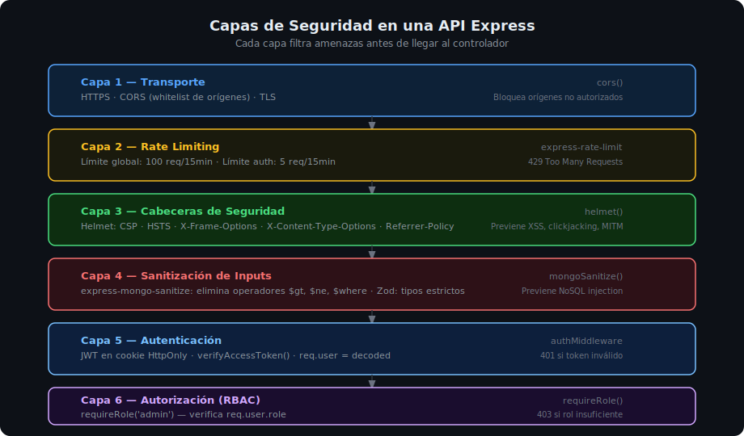

# 02 — Helmet: Cabeceras HTTP de Seguridad

## 🎯 Objetivos

- Entender qué son las cabeceras HTTP de seguridad y por qué son importantes
- Configurar `helmet()` en una API Express
- Conocer las cabeceras más relevantes: CSP, HSTS, X-Content-Type-Options, X-Frame-Options
- Saber cuándo y cómo sobrescribir las opciones por defecto de Helmet



---

## 1. ¿Qué son las cabeceras HTTP de seguridad?

Las **cabeceras de respuesta HTTP** son instrucciones que el servidor envía al navegador para indicar cómo debe comportarse al procesar el contenido. Sin ellas, el navegador asume comportamientos por defecto que pueden ser explotables.

```http
HTTP/1.1 200 OK
Content-Type: application/json
X-Content-Type-Options: nosniff          ← Helmet
X-Frame-Options: SAMEORIGIN              ← Helmet
Strict-Transport-Security: max-age=...   ← Helmet
X-XSS-Protection: 0                     ← Helmet
Content-Security-Policy: default-src... ← Helmet
```

---

## 2. Instalar y aplicar Helmet

```bash
pnpm add helmet@8.0.0
pnpm add -D @types/helmet@4.0.0
```

Aplicar como primer middleware en `app.ts`:

```typescript
import express from 'express';
import helmet from 'helmet';

const app = express();

// Helmet debe ir ANTES que cualquier ruta
app.use(helmet());

app.use(express.json());
// ... resto de middlewares y rutas
```

---

## 3. Cabeceras que aplica Helmet por defecto

| Cabecera | Valor por defecto | Protección |
|----------|-------------------|------------|
| `Content-Security-Policy` | Política restrictiva | Previene XSS e inyección de recursos |
| `Cross-Origin-Embedder-Policy` | `require-corp` | Aislamiento de contexto entre orígenes |
| `Cross-Origin-Opener-Policy` | `same-origin` | Previene acceso entre ventanas/tabs |
| `Cross-Origin-Resource-Policy` | `same-origin` | Controla quién puede embeber recursos |
| `Referrer-Policy` | `no-referrer` | No filtra la URL de origen en requests |
| `Strict-Transport-Security` | `max-age=15552000` | Fuerza HTTPS (solo en producción con HTTPS) |
| `X-Content-Type-Options` | `nosniff` | El navegador no intenta detectar el MIME type |
| `X-DNS-Prefetch-Control` | `off` | Desactiva prefetch DNS |
| `X-Download-Options` | `noopen` | Previene descarga automática en IE |
| `X-Frame-Options` | `SAMEORIGIN` | Previene clickjacking en iframes |
| `X-Permitted-Cross-Domain-Policies` | `none` | Bloquea políticas de Adobe Flash/Acrobat |
| `X-XSS-Protection` | `0` | Deshabilita XSS auditor del navegador (obsoleto) |

### Por qué `X-XSS-Protection: 0`

El XSS auditor de los navegadores fue **deprecado** porque podía ser usado como vector de ataque. Helmet lo desactiva explícitamente. La protección real contra XSS viene de `Content-Security-Policy`.

---

## 4. Cabeceras más importantes en detalle

### Content-Security-Policy (CSP)

Indica al navegador de qué orígenes puede cargar scripts, estilos, imágenes, etc. En una **API REST pura** (sin frontend embebido), puede ser muy restrictivo:

```typescript
app.use(
  helmet({
    contentSecurityPolicy: {
      directives: {
        defaultSrc: ["'none'"],  // Bloquea todo por defecto
        scriptSrc: ["'none'"],   // Sin scripts externos
        styleSrc: ["'none'"],    // Sin estilos externos
        imgSrc: ["'self'"],      // Solo imágenes propias
        connectSrc: ["'self'"],  // Solo conexiones al mismo origen
      },
    },
  })
);
```

Para **desactivar CSP** (en desarrollo o si sirves frontend):

```typescript
app.use(helmet({ contentSecurityPolicy: false }));
```

### Strict-Transport-Security (HSTS)

Le dice al navegador que **siempre use HTTPS** para este dominio. Solo tiene efecto si la conexión inicial es HTTPS.

```typescript
app.use(
  helmet({
    strictTransportSecurity: {
      maxAge: 31536000,      // 1 año en segundos
      includeSubDomains: true,
      preload: true,
    },
  })
);
```

> ⚠️ No activar `preload: true` sin estar seguro — es muy difícil revertirlo.

### X-Frame-Options

Previene que tu app sea embebida en un `<iframe>` de otro sitio (clickjacking):

```typescript
app.use(helmet({ frameguard: { action: 'deny' } })); // nunca en iframe
// o
app.use(helmet({ frameguard: { action: 'sameorigin' } })); // solo en mismo origen
```

---

## 5. Configuración recomendada para APIs REST

```typescript
// src/app.ts
import helmet from 'helmet';

app.use(
  helmet({
    // Para APIs REST sin frontend servido desde este servidor,
    // se puede deshabilitar CSP o dejarlo por defecto
    contentSecurityPolicy: process.env.NODE_ENV === 'production',

    // HSTS solo tiene sentido en producción con HTTPS real
    strictTransportSecurity: process.env.NODE_ENV === 'production',
  })
);
```

---

## 6. Verificar que Helmet funciona

Con Thunder Client o Postman, en la pestaña "Headers" de la respuesta:

```http
X-Content-Type-Options: nosniff
X-Frame-Options: SAMEORIGIN
Cross-Origin-Opener-Policy: same-origin
Referrer-Policy: no-referrer
```

Sin Helmet, **ninguna** de estas cabeceras aparece en una respuesta Express por defecto.

---

## ✅ Checklist de Verificación

- [ ] `helmet()` aplicado antes de cualquier ruta
- [ ] Verificar cabeceras en respuesta con Postman/Thunder Client
- [ ] CSP configurado apropiadamente (no desactivado sin razón en producción)
- [ ] HSTS solo activo en producción con HTTPS

## 📚 Recursos Adicionales

- [Helmet.js — Documentación oficial](https://helmetjs.github.io/)
- [MDN — HTTP Headers de seguridad](https://developer.mozilla.org/en-US/docs/Web/HTTP/Headers#security)
- [OWASP — Security Headers](https://owasp.org/www-project-secure-headers/)
