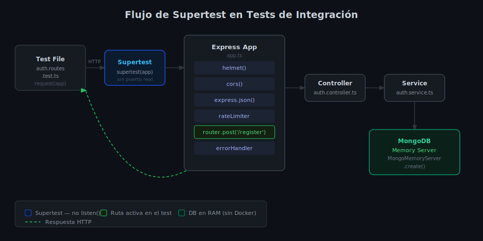

# Tests de Integración con Supertest

## 🎯 Objetivos

- Entender la diferencia entre test unitario y de integración en Express
- Instalar y configurar Supertest para testear endpoints HTTP
- Usar `mongodb-memory-server` para una base de datos limpia en cada suite
- Testear el ciclo completo: HTTP → controller → service → DB



## 1. ¿Qué es un Test de Integración?

Un test de integración verifica que **múltiples capas trabajan juntas correctamente**. En Express, se testea el ciclo completo sin mocks:

```
Supertest → Routes → Controllers → Services → MongoDB (in-memory)
```

A diferencia de los tests unitarios, la base de datos **sí existe** — pero usamos `mongodb-memory-server` para que sea una instancia temporal en RAM, sin necesitar Docker.

## 2. Instalación

```bash
pnpm add -D supertest@7.1.0 @types/supertest@6.0.3
pnpm add -D mongodb-memory-server@10.1.4
```

| Paquete | Rol |
|---------|-----|
| `supertest` | Hace requests HTTP directamente a la app Express sin puerto real |
| `mongodb-memory-server` | MongoDB en RAM para tests, sin Docker |

## 3. La Clave: Separar `app` de `server`

Supertest no necesita que el servidor escuche en un puerto. Importa `app` directamente, **nunca `server`**:

```ts
// src/app.ts — exportar app sin listen()
import express from 'express';
export const app = express();
// ... middlewares y rutas

// src/server.ts — solo el entry point (no se importa en tests)
import { app } from './app.js';
app.listen(3000);

// En el test: importar app
import request from 'supertest';
import { app } from '../src/app';

const res = await request(app).get('/api/v1/health');
expect(res.status).toBe(200);
```

Supertest crea un servidor temporal, hace el request y lo cierra — sin ocupar puertos.

## 4. Setup con `mongodb-memory-server`

```ts
// src/__tests__/setup.ts — configuración compartida
import { MongoMemoryServer } from 'mongodb-memory-server';
import mongoose from 'mongoose';

let mongoServer: MongoMemoryServer;

// Conectar antes de TODOS los tests de la suite
export async function connectTestDB(): Promise<void> {
  mongoServer = await MongoMemoryServer.create();
  const uri = mongoServer.getUri();
  await mongoose.connect(uri);
}

// Limpiar colecciones entre tests (no reiniciar la conexión)
export async function clearTestDB(): Promise<void> {
  const collections = mongoose.connection.collections;
  for (const key in collections) {
    await collections[key].deleteMany({});
  }
}

// Desconectar y destruir la instancia
export async function disconnectTestDB(): Promise<void> {
  await mongoose.disconnect();
  await mongoServer.stop();
}
```

## 5. Tests de Integración para Auth

```ts
// src/__tests__/auth.integration.test.ts
import request from 'supertest';
import { app } from '../app';
import { connectTestDB, clearTestDB, disconnectTestDB } from './setup';

describe('Auth Routes — Integration Tests', () => {
  beforeAll(async () => {
    await connectTestDB();
  });

  afterEach(async () => {
    await clearTestDB(); // base de datos limpia entre tests
  });

  afterAll(async () => {
    await disconnectTestDB();
  });

  // ─────────────────────────────────────────────
  // POST /api/v1/auth/register
  // ─────────────────────────────────────────────

  describe('POST /api/v1/auth/register', () => {
    it('should return 201 and user data on valid input', async () => {
      const res = await request(app)
        .post('/api/v1/auth/register')
        .send({ name: 'Alice', email: 'alice@test.com', password: 'Password1' });

      expect(res.status).toBe(201);
      expect(res.body.data).toMatchObject({
        email: 'alice@test.com',
        name: 'Alice',
        role: 'user',
      });
      // La contraseña nunca debe aparecer en la respuesta
      expect(res.body.data.password).toBeUndefined();
    });

    it('should return 409 when email is already registered', async () => {
      // Registrar primero
      await request(app)
        .post('/api/v1/auth/register')
        .send({ name: 'Alice', email: 'alice@test.com', password: 'Password1' });

      // Intentar registrar de nuevo con el mismo email
      const res = await request(app)
        .post('/api/v1/auth/register')
        .send({ name: 'Alice 2', email: 'alice@test.com', password: 'Password1' });

      expect(res.status).toBe(409);
      expect(res.body.error).toContain('Email already registered');
    });

    it('should return 422 on invalid input (Zod)', async () => {
      const res = await request(app)
        .post('/api/v1/auth/register')
        .send({ name: 'A', email: 'not-an-email', password: '123' });

      expect(res.status).toBe(422);
    });
  });

  // ─────────────────────────────────────────────
  // POST /api/v1/auth/login
  // ─────────────────────────────────────────────

  describe('POST /api/v1/auth/login', () => {
    beforeEach(async () => {
      // Crear un usuario antes de cada test de login
      await request(app)
        .post('/api/v1/auth/register')
        .send({ name: 'Alice', email: 'alice@test.com', password: 'Password1' });
    });

    it('should return 200 and accessToken on valid credentials', async () => {
      const res = await request(app)
        .post('/api/v1/auth/login')
        .send({ email: 'alice@test.com', password: 'Password1' });

      expect(res.status).toBe(200);
      expect(res.body.accessToken).toBeDefined();
      expect(typeof res.body.accessToken).toBe('string');
    });

    it('should return 401 on wrong password', async () => {
      const res = await request(app)
        .post('/api/v1/auth/login')
        .send({ email: 'alice@test.com', password: 'WrongPassword1' });

      expect(res.status).toBe(401);
    });
  });
});
```

## 6. Testear Endpoints Protegidos (con Authorization Header)

```ts
describe('GET /api/v1/auth/me', () => {
  let accessToken: string;

  beforeEach(async () => {
    // Registrar y obtener token
    await request(app)
      .post('/api/v1/auth/register')
      .send({ name: 'Alice', email: 'alice@test.com', password: 'Password1' });

    const loginRes = await request(app)
      .post('/api/v1/auth/login')
      .send({ email: 'alice@test.com', password: 'Password1' });

    accessToken = loginRes.body.accessToken;
  });

  it('should return 200 and user data with valid token', async () => {
    const res = await request(app)
      .get('/api/v1/auth/me')
      .set('Authorization', `Bearer ${accessToken}`);

    expect(res.status).toBe(200);
    expect(res.body.data.email).toBe('alice@test.com');
  });

  it('should return 401 without token', async () => {
    const res = await request(app).get('/api/v1/auth/me');
    expect(res.status).toBe(401);
  });

  it('should return 401 with invalid token', async () => {
    const res = await request(app)
      .get('/api/v1/auth/me')
      .set('Authorization', 'Bearer this.is.invalid');
    expect(res.status).toBe(401);
  });
});
```

## 7. Variables de Entorno para Tests

Los tests necesitan variables de entorno. Crea `.env.test`:

```bash
NODE_ENV=test
JWT_ACCESS_SECRET=test-access-secret-for-jest-only
JWT_REFRESH_SECRET=test-refresh-secret-for-jest-only
JWT_ACCESS_EXPIRES_IN=15m
JWT_REFRESH_EXPIRES_IN=7d
```

En `jest.config.ts`:

```ts
export default {
  // ...
  setupFiles: ['dotenv/config'],  // cargar .env antes de cada test
  // o usar:
  globalSetup: '<rootDir>/src/__tests__/globalSetup.ts',
} satisfies Config;
```

## ✅ Checklist de Verificación

- [ ] `app` exportado sin `listen()` — `server.ts` aparte
- [ ] `mongodb-memory-server` conectado en `beforeAll`, desconectado en `afterAll`
- [ ] `clearTestDB()` en `afterEach` — estado limpio entre tests
- [ ] Tests incluyen casos de error (401, 409, 422) además del happy path
- [ ] El header `Authorization: Bearer <token>` se usa en rutas protegidas
- [ ] `res.body.password` nunca está presente en respuestas
