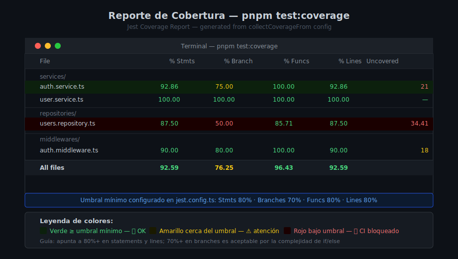

# Mocks Avanzados y Cobertura de Código

## 🎯 Objetivos

- Dominar `jest.mock()` con factory functions y `jest.requireActual`
- Crear mocks automáticos con la carpeta `__mocks__`
- Interpretar el reporte de cobertura (statements, branches, functions, lines)
- Configurar umbrales de cobertura en `jest.config.ts`
- Identificar qué código sí y qué NO se debe testear



## 1. `jest.mock()` con Factory Function

A veces necesitas control total sobre cómo se comporta un módulo mockeado desde el inicio, sin llamar a `mockReturnValue()` después. La factory function ejecuta durante el hoisting:

```ts
// jest.mock() con factory — el módulo 'jsonwebtoken' queda reemplazado completamente
jest.mock('jsonwebtoken', () => ({
  sign: jest.fn().mockReturnValue('mock-access-token'),
  verify: jest.fn().mockReturnValue({ sub: 'user-id-123', role: 'user' }),
}));

// Ahora cualquier código que importe 'jsonwebtoken' obtendrá los mocks
```

**Caso de uso real — mockear `bcrypt` para que no haga hash real:**

```ts
jest.mock('bcrypt', () => ({
  hash: jest.fn().mockResolvedValue('hashed-password'),
  compare: jest.fn().mockResolvedValue(true),
}));
```

## 2. `jest.requireActual` — Mock Parcial de Módulo

Si solo quieres mockear una función y mantener el resto del módulo real:

```ts
// Mockear solo bcrypt.compare, mantener bcrypt.hash real
jest.mock('bcrypt', () => ({
  ...jest.requireActual('bcrypt'),  // todas las funciones reales
  compare: jest.fn().mockResolvedValue(false), // solo esta mockeada
}));
```

Esto es útil para módulos con muchas funciones donde solo una afecta el test.

## 3. Carpeta `__mocks__` — Auto-mock Permanente

La carpeta `__mocks__` permite crear mocks que se aplican automáticamente cuando usas `jest.mock('nombre-modulo')`:

```
src/
├── utils/
│   └── email.ts           # módulo real: envía emails con SMTP
├── __mocks__/
│   └── utils/
│       └── email.ts       # mock: simula el envío sin SMTP real
```

```ts
// src/__mocks__/utils/email.ts
export const sendWelcomeEmail = jest.fn().mockResolvedValue(undefined);
export const sendPasswordReset = jest.fn().mockResolvedValue(undefined);
```

```ts
// En el test: solo activar el mock con jest.mock()
jest.mock('../utils/email');

// Jest usa automáticamente src/__mocks__/utils/email.ts
import { sendWelcomeEmail } from '../utils/email';

it('should call sendWelcomeEmail after register', async () => {
  await authService.register(dto);
  expect(sendWelcomeEmail).toHaveBeenCalledWith('alice@test.com', 'Alice');
});
```

## 4. Cobertura de Código: Los 4 Indicadores

```
| Indicador   | Qué mide                                              |
|-------------|-------------------------------------------------------|
| Statements  | Líneas/declaraciones ejecutadas                       |
| Branches    | Ramas de if/else/switch cubiertas (la más difícil)    |
| Functions   | Funciones que fueron llamadas al menos una vez        |
| Lines       | Líneas físicas del archivo ejecutadas                 |
```

**Ejemplo visual:**

```ts
// auth.service.ts — ¿qué cubre el test?

export async function login(dto: LoginDto): Promise<string> {
  const user = await usersRepo.findByEmail(dto.email);  // ← Statement ✅

  if (!user) {                                           // ← Branch A
    throw new AppError(401, 'Invalid credentials');      // ← ¿cubriste este branch?
  }

  const match = await bcrypt.compare(dto.password, user.password); // ← Statement
  if (!match) {                                          // ← Branch B
    throw new AppError(401, 'Invalid credentials');      // ← ¿cubriste este branch?
  }

  return signAccessToken({ sub: user.id, role: user.role }); // ← Statement ✅
}
```

Para 100% de branches necesitas testear: `user === null` Y `match === false` además del happy path.

## 5. Ejecutar y Leer el Reporte

```bash
pnpm test:coverage
```

Salida en terminal:

```
--------------------|---------|----------|---------|---------|-------------------
File                | % Stmts | % Branch | % Funcs | % Lines | Uncovered Line #s
--------------------|---------|----------|---------|---------|-------------------
All files           |   87.50 |    75.00 |   90.00 |   87.50 |
 services/          |         |          |         |         |
  auth.service.ts   |   85.71 |    66.67 |  100.00 |   85.71 | 14,21
  user.service.ts   |  100.00 |   100.00 |  100.00 |  100.00 |
--------------------|---------|----------|---------|---------|-------------------
```

La columna `Uncovered Line #s` te dice exactamente qué líneas no tienen tests.

También genera `coverage/index.html` — ábrelo en el navegador para ver un reporte visual interactivo.

## 6. Umbrales con `coverageThreshold`

```ts
// jest.config.ts
export default {
  coverageThreshold: {
    global: {
      statements: 80,
      branches: 70,
      functions: 80,
      lines: 80,
    },
    // También se puede configurar por archivo:
    './src/services/': {
      statements: 90,
      functions: 90,
    },
  },
} satisfies Config;
```

Si el coverage cae por debajo del umbral, `pnpm test:coverage` falla con exit code 1 — perfecto para CI/CD.

## 7. Qué NO Testear

No todo el código necesita tests — algunos archivos quedan excluidos del umbral:

```ts
// jest.config.ts — excluir archivos de cobertura
collectCoverageFrom: [
  'src/**/*.ts',
  '!src/server.ts',        // entry point — no contiene lógica
  '!src/types/**',         // solo definición de tipos TypeScript
  '!src/config/*.ts',      // validación de env vars (integración con proceso)
  '!src/**/*.d.ts',        // archivos de declaración
  '!src/migrations/**',    // scripts de migración
],
```

**No testear:**

| Qué | Por qué |
|-----|---------|
| `server.ts` — solo `app.listen()` | No tiene lógica de negocio |
| Interfaces y tipos TypeScript | No son código ejecutable |
| Librerías de terceros (mongoose, bcrypt) | Ya tienen sus propios tests |
| Getters y setters triviales (`get id() { return this._id }`) | Cero riesgo |
| Scripts de migración | Se ejecutan una vez, no en producción |

## 8. TDD — Test Driven Development

El ciclo **Red → Green → Refactor** es la base de TDD:

```
1. RED     Escribir un test que FALLA porque el código no existe aún
           ↓
2. GREEN   Escribir el MÍNIMO código necesario para que el test pase
           ↓
3. REFACTOR Limpiar y mejorar el código sin romper los tests
           ↓
           Repetir para el siguiente comportamiento
```

**Beneficio principal**: el test define el contrato antes de la implementación — obliga a pensar en la API pública de la función antes de su lógica interna.

```ts
// PASO RED: test falla porque loginWithGoogle no existe
it('should create user on first Google login', async () => {
  const user = await authService.loginWithGoogle('google-token-123');
  expect(user.email).toBe('alice@gmail.com');
  // ❌ FAIL: TypeError: authService.loginWithGoogle is not a function
});

// PASO GREEN: implementar loginWithGoogle para que el test pase
// PASO REFACTOR: mejorar la implementación, los tests protegen el comportamiento
```

## ✅ Checklist de Verificación

- [ ] `jest.mock()` con factory para mocks complejos (bcrypt, jwt)
- [ ] `jest.requireActual` cuando solo se mockea parte del módulo
- [ ] Carpeta `__mocks__` para módulos mockeados en múltiples tests
- [ ] `coverageThreshold` configurado en `jest.config.ts`
- [ ] `collectCoverageFrom` excluye `server.ts`, tipos y migraciones
- [ ] Tanto el happy path como los branches de error están testeados
- [ ] `pnpm test:coverage` pasa sin bajar del umbral
