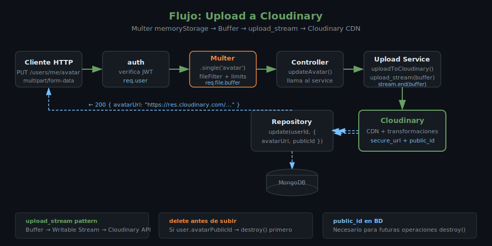

# Cloudinary: Almacenamiento de Archivos en la Nube

## 🎯 Objetivos

- Configurar el SDK de Cloudinary con variables de entorno
- Subir archivos desde un buffer de memoria (integración con Multer `memoryStorage`)
- Obtener la URL pública y el `public_id` de un recurso subido
- Eliminar recursos de Cloudinary con `uploader.destroy()`
- Aplicar transformaciones básicas (resize, crop, quality)

## 📋 ¿Qué es Cloudinary?

Cloudinary es un servicio de cloud storage especializado en imágenes y video.
A diferencia de S3, incluye un pipeline de transformaciones: puedes redimensionar,
recortar, convertir formato y optimizar imágenes al vuelo con solo cambiar la URL.



```
Express App  →  Multer (memoryStorage)  →  req.file.buffer
     ↓
cloudinary.uploader.upload_stream()  →  Cloudinary CDN  →  URL pública
```

## 1. Instalación

```bash
pnpm add cloudinary@2.6.1
```

> SDK oficial de Cloudinary v2 para Node.js.

## 2. Configuración con variables de entorno

```ts
// src/config/cloudinary.ts
import { v2 as cloudinary } from 'cloudinary';
import { env } from './env';

cloudinary.config({
  cloud_name: env.CLOUDINARY_CLOUD_NAME,
  api_key: env.CLOUDINARY_API_KEY,
  api_secret: env.CLOUDINARY_API_SECRET,
});

export { cloudinary };
```

```ts
// src/config/env.ts (fragmento — añadir al schema Zod existente)
import { z } from 'zod';

const envSchema = z.object({
  // ... otras variables
  CLOUDINARY_CLOUD_NAME: z.string().min(1),
  CLOUDINARY_API_KEY: z.string().min(1),
  CLOUDINARY_API_SECRET: z.string().min(1),
});
```

```bash
# .env.example
CLOUDINARY_CLOUD_NAME=tu_cloud_name
CLOUDINARY_API_KEY=tu_api_key
CLOUDINARY_API_SECRET=tu_api_secret
```

> Consigue tus credenciales gratis en [cloudinary.com](https://cloudinary.com) (plan Free: 25 GB almacenamiento, 25 GB bandwidth/mes)

## 3. Subir desde buffer (integración con Multer)

Cloudinary no acepta `Buffer` directamente en `uploader.upload()`. Se usa `upload_stream` para hacer streaming desde el buffer:

```ts
// src/services/upload.service.ts
import { cloudinary } from '../config/cloudinary';

export interface UploadResult {
  url: string;
  publicId: string;
}

export async function uploadToCloudinary(
  buffer: Buffer,
  folder: string,
  publicId?: string
): Promise<UploadResult> {
  return new Promise((resolve, reject) => {
    const options = {
      folder,
      public_id: publicId,
      overwrite: true,
      // Convertir automáticamente a WebP para optimizar
      format: 'webp',
      // Calidad automática basada en el contenido
      quality: 'auto',
    };

    const stream = cloudinary.uploader.upload_stream(options, (error, result) => {
      if (error) {
        reject(new Error(`Error al subir a Cloudinary: ${error.message}`));
        return;
      }
      if (!result) {
        reject(new Error('Cloudinary no retornó resultado'));
        return;
      }
      resolve({
        url: result.secure_url,      // URL HTTPS del recurso
        publicId: result.public_id,  // Identificador único en Cloudinary
      });
    });

    // Enviar el buffer al stream
    stream.end(buffer);
  });
}
```

### Uso en el servicio de usuarios

```ts
// src/services/users.service.ts
import { uploadToCloudinary } from './upload.service';
import { deleteFromCloudinary } from './upload.service';

export async function updateAvatar(
  userId: string,
  file: Express.Multer.File
): Promise<string> {
  const user = await usersRepository.findById(userId);
  if (!user) throw new AppError(404, 'Usuario no encontrado');

  // Eliminar el avatar anterior si existe
  if (user.avatarPublicId) {
    await deleteFromCloudinary(user.avatarPublicId);
  }

  // Subir el nuevo avatar
  // El public_id incluye el userId para que cada usuario tenga su carpeta
  const { url, publicId } = await uploadToCloudinary(
    file.buffer,
    'avatars',
    `avatar-${userId}`
  );

  // Persistir URL y publicId en la base de datos
  await usersRepository.update(userId, {
    avatarUrl: url,
    avatarPublicId: publicId,
  });

  return url;
}
```

## 4. Eliminar recursos

```ts
// src/services/upload.service.ts
export async function deleteFromCloudinary(publicId: string): Promise<void> {
  const result = await cloudinary.uploader.destroy(publicId);

  // result.result === 'ok' si se eliminó correctamente
  // result.result === 'not found' si no existía (no lanzar error)
  if (result.result !== 'ok' && result.result !== 'not found') {
    throw new Error(`Error al eliminar de Cloudinary: ${result.result}`);
  }
}
```

> **Importante**: Siempre guardar el `public_id` en la base de datos al subir un archivo. Sin él no puedes eliminarlo después.

## 5. Transformaciones en la URL

Una de las ventajas de Cloudinary es que las transformaciones son parte de la URL.
No necesitas reprocesar el archivo — simplemente cambias la URL:

```ts
import { cloudinary } from '../config/cloudinary';

// Generar URL con transformaciones on-the-fly
const thumbnailUrl = cloudinary.url(publicId, {
  width: 150,
  height: 150,
  crop: 'fill',      // Recortar y llenar el espacio
  gravity: 'face',   // Centrar en la cara detectada
  format: 'webp',
  quality: 'auto',
});
// https://res.cloudinary.com/cloud/image/upload/w_150,h_150,c_fill,g_face,f_webp,q_auto/public_id
```

### Transformaciones comunes

| Parámetro | Ejemplo | Efecto |
|-----------|---------|--------|
| `width/height` | `300/300` | Redimensionar |
| `crop: 'fill'` | — | Recortar al tamaño exacto |
| `crop: 'fit'` | — | Escalar sin recortar |
| `gravity: 'face'` | — | Centrar en cara |
| `format: 'webp'` | — | Convertir a WebP |
| `quality: 'auto'` | — | Calidad óptima automática |

## 6. Flujo completo: Controller → Service → Cloudinary

```
PUT /users/me/avatar
      ↓
auth middleware (verifica token)
      ↓
multer.single('avatar') (valida MIME, tamaño; guarda en buffer)
      ↓
usersController.updateAvatar(req, res, next)
      ↓
usersService.updateAvatar(userId, req.file)
      ↓
uploadService.uploadToCloudinary(buffer, 'avatars', `avatar-${userId}`)
      ↓
Cloudinary → retorna { url, publicId }
      ↓
usersRepository.update(userId, { avatarUrl, avatarPublicId })
      ↓
res.json({ avatarUrl })
```

## ✅ Checklist de Verificación

- [ ] Credenciales de Cloudinary en variables de entorno (nunca hardcodeadas)
- [ ] `public_id` persistido en base de datos junto con la URL
- [ ] Avatar anterior eliminado de Cloudinary antes de subir el nuevo
- [ ] Errores de Cloudinary propagados al middleware de error
- [ ] `upload_stream` usado correctamente con `stream.end(buffer)`

## 📚 Recursos Adicionales

- [Cloudinary Node.js SDK](https://cloudinary.com/documentation/node_integration)
- [Upload API Reference](https://cloudinary.com/documentation/image_upload_api_reference)
- [URL Transformation Reference](https://cloudinary.com/documentation/transformation_reference)
