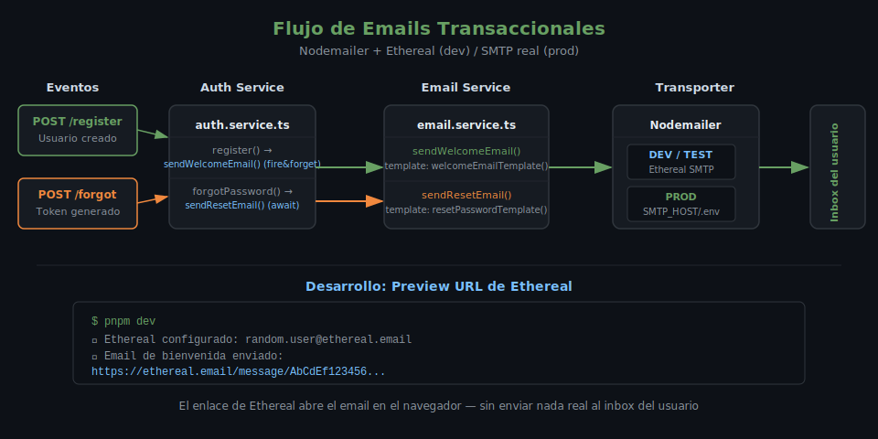

# Nodemailer: Emails Transaccionales

## 🎯 Objetivos

- Configurar un transporter SMTP con Nodemailer
- Usar Ethereal para testear el envío de emails sin cuenta real de producción
- Crear templates HTML reutilizables para emails transaccionales
- Enviar email de bienvenida al registrar un usuario
- Implementar el flujo de reset de contraseña con token temporal

## 📋 ¿Qué es Nodemailer?

Nodemailer es la librería estándar de Node.js para enviar emails. Funciona con
cualquier proveedor SMTP: Gmail, SendGrid, Mailgun, Brevo, o incluso un servidor SMTP propio.



```
Servicio  →  emailService.send()  →  Nodemailer Transporter  →  SMTP Provider  →  Inbox
```

## 1. Instalación

```bash
pnpm add nodemailer@6.10.1
pnpm add -D @types/nodemailer@6.4.17
```

## 2. Configuración del transporter

### Ethereal (para desarrollo y testing)

Ethereal es un servicio de SMTP falso — captura todos los emails sin enviarlos realmente.
Ideal para desarrollo y tests: no necesitas cuenta real, los emails se pueden ver en el navegador.

```ts
// src/config/email.ts
import nodemailer from 'nodemailer';
import { env } from './env';

let transporter: nodemailer.Transporter;

export async function getTransporter(): Promise<nodemailer.Transporter> {
  if (transporter) return transporter;

  if (env.NODE_ENV === 'test' || env.NODE_ENV === 'development') {
    // Ethereal: genera credenciales temporales automáticamente
    const testAccount = await nodemailer.createTestAccount();

    transporter = nodemailer.createTransport({
      host: 'smtp.ethereal.email',
      port: 587,
      secure: false,
      auth: {
        user: testAccount.user,
        pass: testAccount.pass,
      },
    });

    console.log('📧 Ethereal configurado:', testAccount.user);
    return transporter;
  }

  // Producción: usar SMTP real configurado en .env
  transporter = nodemailer.createTransport({
    host: env.SMTP_HOST,
    port: env.SMTP_PORT,
    secure: env.SMTP_SECURE,
    auth: {
      user: env.SMTP_USER,
      pass: env.SMTP_PASS,
    },
  });

  return transporter;
}
```

### Variables de entorno para producción

```bash
# .env.example
SMTP_HOST=smtp.gmail.com
SMTP_PORT=587
SMTP_SECURE=false
SMTP_USER=tu_email@gmail.com
SMTP_PASS=tu_app_password
EMAIL_FROM='"Bootcamp App" <noreply@example.com>'
```

## 3. Templates HTML para emails

En lugar de concatenar strings, usa una función que retorne HTML estructurado:

```ts
// src/utils/email-templates.ts

export function welcomeEmailTemplate(name: string): string {
  return `
<!DOCTYPE html>
<html lang="es">
<head>
  <meta charset="UTF-8">
  <meta name="viewport" content="width=device-width, initial-scale=1.0">
  <title>Bienvenido</title>
  <style>
    body { font-family: 'Segoe UI', Arial, sans-serif; background: #f5f5f5; margin: 0; padding: 0; }
    .container { max-width: 600px; margin: 40px auto; background: #ffffff; border-radius: 8px; overflow: hidden; }
    .header { background: #68A063; padding: 32px; text-align: center; }
    .header h1 { color: #ffffff; margin: 0; font-size: 24px; }
    .body { padding: 32px; color: #333333; }
    .body p { line-height: 1.6; }
    .footer { background: #f0f0f0; padding: 16px; text-align: center; font-size: 12px; color: #888888; }
  </style>
</head>
<body>
  <div class="container">
    <div class="header">
      <h1>¡Bienvenido!</h1>
    </div>
    <div class="body">
      <p>Hola <strong>${name}</strong>,</p>
      <p>Tu cuenta ha sido creada exitosamente. Ya puedes comenzar a usar la plataforma.</p>
      <p>Si tienes alguna pregunta, no dudes en contactarnos.</p>
      <p>¡Que tengas un excelente día!</p>
    </div>
    <div class="footer">
      <p>Este es un email automático, por favor no respondas directamente.</p>
    </div>
  </div>
</body>
</html>
  `.trim();
}

export function resetPasswordEmailTemplate(name: string, resetUrl: string): string {
  return `
<!DOCTYPE html>
<html lang="es">
<head>
  <meta charset="UTF-8">
  <title>Restablecer contraseña</title>
  <style>
    body { font-family: 'Segoe UI', Arial, sans-serif; background: #f5f5f5; margin: 0; padding: 0; }
    .container { max-width: 600px; margin: 40px auto; background: #ffffff; border-radius: 8px; overflow: hidden; }
    .header { background: #222222; padding: 32px; text-align: center; }
    .header h1 { color: #ffffff; margin: 0; font-size: 24px; }
    .body { padding: 32px; color: #333333; }
    .btn { display: inline-block; background: #68A063; color: #ffffff; padding: 14px 28px; border-radius: 6px; text-decoration: none; font-weight: bold; margin: 16px 0; }
    .warning { background: #fff3cd; border-left: 4px solid #ffc107; padding: 12px 16px; margin-top: 24px; font-size: 13px; }
    .footer { background: #f0f0f0; padding: 16px; text-align: center; font-size: 12px; color: #888888; }
  </style>
</head>
<body>
  <div class="container">
    <div class="header">
      <h1>Restablecer Contraseña</h1>
    </div>
    <div class="body">
      <p>Hola <strong>${name}</strong>,</p>
      <p>Recibimos una solicitud para restablecer la contraseña de tu cuenta.</p>
      <p>Haz clic en el siguiente botón para crear una nueva contraseña:</p>
      <a href="${resetUrl}" class="btn">Restablecer contraseña</a>
      <div class="warning">
        <strong>⚠️ Este enlace expira en 1 hora.</strong><br>
        Si no solicitaste restablecer tu contraseña, ignora este email.
      </div>
    </div>
    <div class="footer">
      <p>Por seguridad, nunca compartas este enlace con nadie.</p>
    </div>
  </div>
</body>
</html>
  `.trim();
}
```

## 4. Servicio de emails

```ts
// src/services/email.service.ts
import nodemailer from 'nodemailer';
import { getTransporter } from '../config/email';
import { welcomeEmailTemplate, resetPasswordEmailTemplate } from '../utils/email-templates';
import { env } from '../config/env';

export async function sendWelcomeEmail(to: string, name: string): Promise<void> {
  const transporter = await getTransporter();

  const info = await transporter.sendMail({
    from: env.EMAIL_FROM ?? '"App" <noreply@example.com>',
    to,
    subject: '¡Bienvenido a la plataforma!',
    html: welcomeEmailTemplate(name),
  });

  // En desarrollo, mostrar el enlace de previsualización de Ethereal
  if (env.NODE_ENV !== 'production') {
    console.log('📧 Email de bienvenida enviado:', nodemailer.getTestMessageUrl(info));
  }
}

export async function sendResetPasswordEmail(
  to: string,
  name: string,
  resetToken: string
): Promise<void> {
  const transporter = await getTransporter();

  // Construir la URL de reset (el frontend la maneja)
  const resetUrl = `${env.FRONTEND_URL}/reset-password?token=${resetToken}`;

  const info = await transporter.sendMail({
    from: env.EMAIL_FROM ?? '"App" <noreply@example.com>',
    to,
    subject: 'Solicitud de restablecimiento de contraseña',
    html: resetPasswordEmailTemplate(name, resetUrl),
  });

  if (env.NODE_ENV !== 'production') {
    console.log('📧 Email de reset enviado:', nodemailer.getTestMessageUrl(info));
  }
}
```

## 5. Integración con el servicio de autenticación

```ts
// src/services/auth.service.ts (fragmento — register)
import { sendWelcomeEmail } from './email.service';

export async function register(dto: RegisterDto): Promise<AuthTokens> {
  const existing = await usersRepository.findByEmail(dto.email);
  if (existing) throw new AppError(409, 'El email ya está registrado');

  const hashed = await bcrypt.hash(dto.password, 10);
  const user = await usersRepository.create({ ...dto, password: hashed });

  // Enviar email de bienvenida de forma asíncrona
  // No esperamos el resultado para no retrasar la respuesta al cliente
  sendWelcomeEmail(user.email, user.name).catch((err) => {
    console.error('Error enviando email de bienvenida:', err);
  });

  return generateTokens(user);
}
```

> **Patrón fire-and-forget**: El `sendWelcomeEmail` se llama sin `await` para que la respuesta al cliente no espere el email. El `.catch()` evita que un error de email haga crashear el proceso.

## 6. Flujo de reset de contraseña

```
1. POST /auth/forgot-password  { email }
      → Genera un token aleatorio (crypto.randomBytes)
      → Guarda el token hasheado + expiración en BD
      → Envía email con la URL de reset
      → Retorna 200 (sin revelar si el email existe o no)

2. POST /auth/reset-password  { token, newPassword }
      → Busca el token hasheado en BD
      → Verifica que no haya expirado
      → Actualiza la contraseña con bcrypt
      → Elimina el token de BD
      → Retorna 200
```

```ts
// src/services/auth.service.ts (fragmento — forgot password)
import crypto from 'crypto';

export async function forgotPassword(email: string): Promise<void> {
  const user = await usersRepository.findByEmail(email);

  // No revelar si el email existe (previene user enumeration)
  if (!user) return;

  // Generar token seguro
  const resetToken = crypto.randomBytes(32).toString('hex');
  // Guardar el hash del token (nunca el token en texto plano)
  const hashedToken = crypto.createHash('sha256').update(resetToken).digest('hex');
  const expiresAt = new Date(Date.now() + 60 * 60 * 1000); // 1 hora

  await usersRepository.saveResetToken(user.id, hashedToken, expiresAt);

  await sendResetPasswordEmail(user.email, user.name, resetToken);
}
```

## ✅ Checklist de Verificación

- [ ] Ethereal configurado para desarrollo (ningún email real enviado en dev)
- [ ] Templates HTML separados en `utils/email-templates.ts`
- [ ] Email de bienvenida enviado en fire-and-forget (no bloquea el registro)
- [ ] Token de reset hasheado antes de guardar en BD (nunca en texto plano)
- [ ] URL de reset construida con `FRONTEND_URL` de variables de entorno
- [ ] Preview URL de Ethereal mostrada en consola en modo desarrollo

## 📚 Recursos Adicionales

- [Nodemailer Documentation](https://nodemailer.com/about/)
- [Ethereal Email](https://ethereal.email/)
- [Email Security Best Practices](https://nodemailer.com/smtp/)
