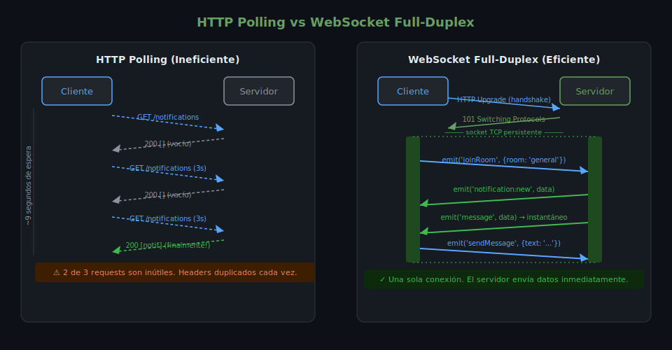

# WebSockets: Fundamentos del Protocolo

## 🎯 Objetivos

- Comprender las limitaciones de HTTP para comunicación en tiempo real
- Entender el proceso de handshake de WebSocket
- Identificar cuándo usar WebSocket vs HTTP tradicional

---

## 1. El Problema con HTTP

HTTP es un protocolo **request-response**: el cliente solicita, el servidor responde y la
conexión se cierra. Esto es un problema cuando el servidor necesita **enviar datos
al cliente** sin que el cliente los solicite.



### Soluciones tradicionales (costosas)

**Short Polling** — el cliente pregunta cada N segundos:
```ts
// ❌ Ineficiente — muchas peticiones aunque no haya datos nuevos
setInterval(async () => {
  const res = await fetch('/api/notifications');
  const data = await res.json();
  renderNotifications(data);
}, 3000);
```

**Long Polling** — el servidor mantiene la request abierta hasta tener datos:
```ts
// ⚠️ Mejor que polling, pero aún costoso — una conexión por actualización
async function poll() {
  const res = await fetch('/api/long-poll'); // espera hasta 30s
  render(await res.json());
  poll(); // inmediatamente vuelve a conectar
}
```

Los problemas: muchas conexiones TCP, headers HTTP duplicados en cada request,
latencia artificial, costoso en servidores con muchos clientes.

---

## 2. El Protocolo WebSocket

WebSocket (RFC 6455) es un protocolo que permite una **conexión persistente y
bidireccional** entre cliente y servidor sobre una única conexión TCP.

### Características clave

| Característica | HTTP | WebSocket |
|----------------|------|-----------|
| Dirección | Unidireccional (client → server) | Full-duplex (ambos sentidos) |
| Conexión | Se cierra después de cada request | Persistente hasta que se cierra |
| Overhead | Headers completos en cada request | Solo en el handshake inicial |
| Latencia | Alta (nueva conexión) | Muy baja (conexión ya establecida) |
| Uso RAM servidor | Bajo por request | Moderado (conexión activa) |

### Esquema URI

```
ws://  → WebSocket sin cifrar (no usar en producción)
wss:// → WebSocket sobre TLS (equivalente a HTTPS)
```

---

## 3. El Handshake HTTP → WebSocket

La conexión WebSocket comienza con un request HTTP normal que solicita un "upgrade":

```http
GET /socket.io/?transport=websocket HTTP/1.1
Host: localhost:3000
Upgrade: websocket
Connection: Upgrade
Sec-WebSocket-Key: dGhlIHNhbXBsZSBub25jZQ==
Sec-WebSocket-Version: 13
```

El servidor responde con `101 Switching Protocols`:

```http
HTTP/1.1 101 Switching Protocols
Upgrade: websocket
Connection: Upgrade
Sec-WebSocket-Accept: s3pPLMBiTxaQ9kYGzzhZRbK+xOo=
```

A partir de este momento, el protocolo HTTP queda atrás y la conexión TCP se usa
directamente para frames binarios de WebSocket.

---

## 4. Casos de Uso Adecuados para WebSocket

| Caso de Uso | Por qué WebSocket |
|-------------|-------------------|
| Chat en tiempo real | Mensajes instantáneos bidireccionales |
| Notificaciones push | Servidor envía sin que el cliente solicite |
| Dashboards de métricas | Actualizaciones frecuentes de datos |
| Colaboración en vivo (Google Docs) | Múltiples usuarios editando simultáneamente |
| Juegos multijugador | Latencia crítica, actualizaciones constantes |
| Órdenes de bolsa/crypto | Precios cambian múltiples veces por segundo |

---

## 5. ¿Por qué Socket.io en lugar de WebSocket nativo?

La API nativa de WebSocket (`new WebSocket('ws://...')`) es funcional pero básica:

```ts
// WebSocket nativo — sin abstracciones
const ws = new WebSocket('ws://localhost:3000');
ws.onmessage = (event) => {
  const data = JSON.parse(event.data); // siempre strings
  if (data.type === 'message') handleMessage(data);
  if (data.type === 'notification') handleNotification(data);
};
ws.send(JSON.stringify({ type: 'message', text: 'Hola' }));
```

Socket.io agrega una capa de abstracción con ventajas concretas:

| Característica | WebSocket nativo | Socket.io |
|----------------|-----------------|-----------|
| Eventos tipados | ❌ Todo son strings | ✅ `socket.on('message', cb)` |
| Rooms | ❌ Manual | ✅ `socket.join('sala')` |
| Namespaces | ❌ No existe | ✅ `io.of('/chat')` |
| Reconnection automática | ❌ Manual | ✅ Incluida |
| Fallback (polling) | ❌ No | ✅ Si WS falla |
| Broadcasting | ❌ Manual | ✅ `io.emit()`, `io.to()` |
| Tipos TypeScript | Parcial | ✅ Completo |

Socket.io **no es WebSocket puro** — usa WebSocket cuando está disponible, pero
tiene su propio protocolo de mensajería por encima que incluye heartbeats,
reconexión y multiplexing.

---

## ✅ Checklist de Verificación

- [ ] Entiendo por qué HTTP no es óptimo para comunicación en tiempo real
- [ ] Sé qué código de estado indica el upgrade a WebSocket
- [ ] Puedo explicar la diferencia entre `ws://` y `wss://`
- [ ] Identifico al menos 3 casos de uso apropiados para WebSocket
- [ ] Entiendo por qué Socket.io añade valor sobre WebSocket nativo

---

## 📚 Recursos Adicionales

- [RFC 6455 — WebSocket Protocol](https://datatracker.ietf.org/doc/html/rfc6455)
- [MDN — WebSocket API](https://developer.mozilla.org/en-US/docs/Web/API/WebSocket)
- [Socket.io — Why Socket.io](https://socket.io/docs/v4/index/)
