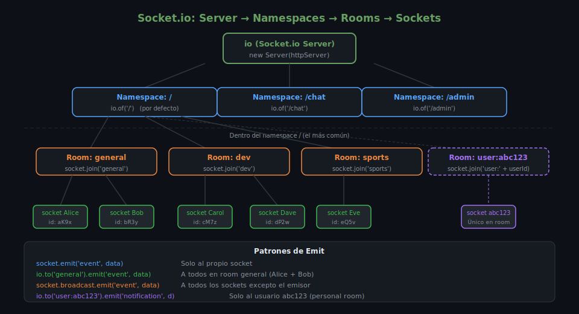

# Socket.io: Servidor

## 🎯 Objetivos

- Instalar y configurar un servidor Socket.io integrado con Express
- Gestionar eventos de conexión y mensajes personalizados
- Organizar clientes en rooms para comunicación dirigida
- Usar patrones de emit para diferentes audiencias

---

## 1. Instalación

```bash
pnpm add socket.io@4.8.1
pnpm add -D @types/node@22.15.3
```

Socket.io v4 incluye sus propias definiciones TypeScript — no se necesita
un paquete `@types/socket.io` separado.

---

## 2. Integración con Express

Socket.io necesita acceso al **servidor HTTP** (no al objeto `app` de Express) para
interceptar las conexiones WebSocket:

```ts
// src/server.ts
import http from 'http';
import { Server } from 'socket.io';
import { app } from './app';

// 1. Crear servidor HTTP a partir del app Express
const httpServer = http.createServer(app);

// 2. Crear servidor Socket.io sobre el servidor HTTP
const io = new Server(httpServer, {
  cors: {
    origin: process.env.FRONTEND_URL ?? 'http://localhost:5173',
    credentials: true,
  },
});

// 3. Escuchar conexiones
io.on('connection', (socket) => {
  console.log(`🔌 Cliente conectado: ${socket.id}`);

  socket.on('disconnect', (reason) => {
    console.log(`❌ Cliente desconectado: ${socket.id} (${reason})`);
  });
});

// 4. Escuchar en el servidor HTTP (no app.listen)
httpServer.listen(3000, () => {
  console.log('🚀 Servidor en http://localhost:3000');
});
```

> ⚠️ **Error común**: usar `app.listen()` en lugar de `httpServer.listen()`.
> `app.listen()` crea su propio servidor HTTP interno al que Socket.io no tiene acceso.

---

## 3. Tipos en TypeScript

Socket.io permite tipar los eventos de entrada y salida para detectar errores en
tiempo de compilación:

```ts
// src/types/index.ts

// Eventos que el servidor ENVÍA al cliente
export interface ServerToClientEvents {
  message: (data: { id: string; text: string; username: string; room: string }) => void;
  userJoined: (data: { username: string; room: string }) => void;
  userLeft: (data: { username: string; room: string }) => void;
  notification: (data: { title: string; body: string }) => void;
}

// Eventos que el cliente ENVÍA al servidor
export interface ClientToServerEvents {
  joinRoom: (data: { username: string; room: string }) => void;
  sendMessage: (data: { text: string; room: string }) => void;
  leaveRoom: (room: string) => void;
}

// Datos adjuntos a cada socket (persisten durante la sesión)
export interface SocketData {
  username: string;
  userId?: string;
  currentRoom?: string;
}
```

```ts
// Uso en server.ts
import { Server, Socket } from 'socket.io';
import {
  ServerToClientEvents,
  ClientToServerEvents,
  SocketData,
} from './types';

type TypedServer = Server<ClientToServerEvents, ServerToClientEvents, Record<string, never>, SocketData>;
type TypedSocket = Socket<ClientToServerEvents, ServerToClientEvents, Record<string, never>, SocketData>;

const io: TypedServer = new Server(httpServer, { cors: { origin: '*' } });

io.on('connection', (socket: TypedSocket) => {
  // TypeScript conoce los eventos disponibles → autocompletado y validación
  socket.on('sendMessage', (data) => { /* data.text: string — tipado */ });
});
```

---

## 4. Patrones de Emit



| Patrón | Código | Destinatario |
|--------|--------|--------------|
| Al propio socket | `socket.emit('event', data)` | Solo el remitente |
| A todos en el servidor | `io.emit('event', data)` | Todos los sockets conectados |
| A una sala (sin el emisor) | `socket.to('sala').emit('event', data)` | Sala, excluye remitente |
| A una sala (con el emisor) | `io.to('sala').emit('event', data)` | Sala completa |
| A todos excepto el emisor | `socket.broadcast.emit('event', data)` | Todos excepto remitente |
| A un socket específico | `io.to(socketId).emit('event', data)` | Socket por ID |

```ts
io.on('connection', (socket) => {
  // Solo al que se conectó
  socket.emit('welcome', { message: '¡Hola!' });

  // A todos los demás conectados
  socket.broadcast.emit('newUser', { id: socket.id });

  // Evento personalizado que llega a la sala "general" completa
  io.to('general').emit('announcement', { text: 'Nuevo contenido disponible' });
});
```

---

## 5. Rooms

Los rooms permiten agrupar sockets para enviar mensajes a subconjuntos:

```ts
io.on('connection', (socket) => {
  // Unirse a una sala
  socket.on('joinRoom', async ({ username, room }) => {
    // Salir de sala anterior si existía
    if (socket.data.currentRoom) {
      socket.leave(socket.data.currentRoom);
      socket.to(socket.data.currentRoom).emit('userLeft', { username, room: socket.data.currentRoom });
    }

    // Unirse a la nueva sala
    await socket.join(room);
    socket.data.username = username;
    socket.data.currentRoom = room;

    // Notificar a los demás en la sala (no al que acaba de unirse)
    socket.to(room).emit('userJoined', { username, room });

    // Enviar lista de usuarios actuales en la sala
    const sockets = await io.in(room).fetchSockets();
    const users = sockets.map((s) => s.data.username).filter(Boolean);
    io.to(room).emit('roomUsers', { room, users });
  });

  // Salir de una sala
  socket.on('leaveRoom', (room) => {
    socket.leave(room);
    socket.to(room).emit('userLeft', { username: socket.data.username ?? 'Anónimo', room });
  });

  // Enviar mensaje a sala
  socket.on('sendMessage', ({ text, room }) => {
    io.to(room).emit('message', {
      id: `${Date.now()}`,
      text,
      username: socket.data.username ?? 'Anónimo',
      room,
    });
  });

  // Desconexión automática
  socket.on('disconnect', () => {
    if (socket.data.currentRoom) {
      socket.to(socket.data.currentRoom).emit('userLeft', {
        username: socket.data.username ?? 'Desconocido',
        room: socket.data.currentRoom,
      });
    }
  });
});
```

---

## 6. Namespaces

Los namespaces son como "sub-servidores" dentro del mismo servidor Socket.io.
Útiles para separar lógicas distintas (chat vs notificaciones vs admin):

```ts
// Namespace por defecto: '/'
io.on('connection', (socket) => { /* ... */ });

// Namespace personalizado
const chatNsp = io.of('/chat');
chatNsp.on('connection', (socket) => {
  console.log('Conectado al namespace /chat:', socket.id);
});

const adminNsp = io.of('/admin');
adminNsp.on('connection', (socket) => {
  // Solo personal de administración debería conectarse aquí
  console.log('Conectado al namespace /admin:', socket.id);
});
```

> Para la mayoría de aplicaciones, **rooms son suficientes**. Usar namespaces cuando
> necesitas separar contextos lógicos completamente distintos o aplicar middleware
> diferente por sección.

---

## ✅ Checklist de Verificación

- [ ] Socket.io inicializado sobre `http.createServer(app)`, no sobre `app`
- [ ] Tipos de eventos definidos en interfaces TypeScript
- [ ] Patrones de emit usados correctamente según la audiencia
- [ ] Rooms usados para mensajes dirigidos a grupos
- [ ] Evento `disconnect` manejado para limpiar estado

---

## 📚 Recursos Adicionales

- [Socket.io — Server API](https://socket.io/docs/v4/server-api/)
- [Socket.io — Rooms](https://socket.io/docs/v4/rooms/)
- [Socket.io — TypeScript](https://socket.io/docs/v4/typescript/)
