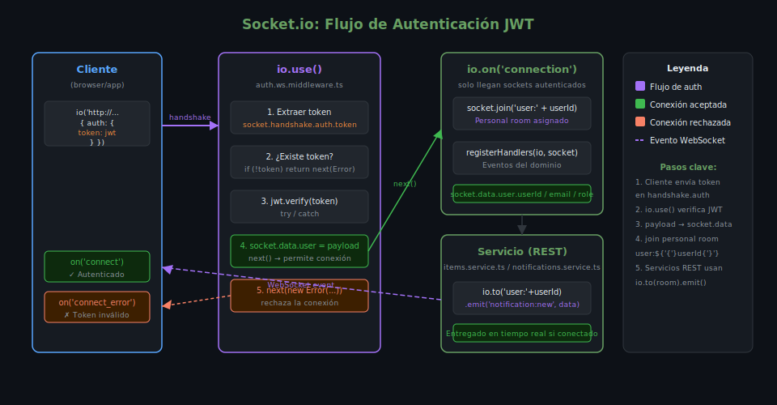

# Autenticación en WebSockets con JWT

## 🎯 Objetivos

- Implementar middleware de autenticación en Socket.io con `io.use()`
- Extraer y verificar JWT del handshake de conexión
- Adjuntar datos del usuario autenticado al socket
- Usar personal rooms para emitir a usuarios específicos

---

## 1. ¿Por qué autenticar conexiones WebSocket?

HTTP tiene guardianes por petición (middlewares de Express). WebSocket
es una **conexión persistente** — una vez establecida, cualquier evento
puede ejecutarse sin verificación adicional si no hay autenticación.

Sin autenticación, cualquier cliente anónimo podría:
- Recibir notificaciones ajenas
- Emitir eventos como otro usuario
- Acceder a rooms privadas

---

## 2. El Middleware `io.use()`

`io.use()` se ejecuta **una vez por conexión**, antes del evento `connection`.
Es el lugar correcto para validar el token JWT:

```ts
// src/middlewares/auth.ws.ts
import { Server } from 'socket.io';
import { verifyAccessToken } from '../utils/jwt';
import type { TypedServer } from '../types';

export function authWsMiddleware(io: TypedServer): void {
  io.use((socket, next) => {
    // 1. Extraer el token del handshake
    const token = socket.handshake.auth?.token as string | undefined;

    if (!token) {
      // next() con Error rechaza la conexión y emite 'connect_error' al cliente
      return next(new Error('auth_error: token requerido'));
    }

    // 2. Verificar el token
    try {
      const payload = verifyAccessToken(token);
      // 3. Adjuntar el payload al socket para uso posterior
      socket.data.user = payload;
      next();
    } catch {
      next(new Error('auth_error: token inválido o expirado'));
    }
  });
}
```

> `socket.handshake.auth` contiene el objeto `auth` que el cliente pasó al conectar:
> ```ts
> // Cliente:
> io('http://localhost:3000', { auth: { token: 'Bearer eyJ...' } })
> ```

---

## 3. Registro del Middleware

El middleware debe registrarse **antes** del evento `connection`:

```ts
// src/server.ts
import { authWsMiddleware } from './middlewares/auth.ws';
import { registerHandlers } from './handlers';

const io = new Server(httpServer, { cors: { origin: '*' } });

// 1. Middleware de autenticación (ejecuta en cada nueva conexión)
authWsMiddleware(io);

// 2. Handlers (solo llegan conexiones autenticadas)
io.on('connection', (socket) => {
  console.log(`✅ ${socket.data.user.email} conectado`);
  registerHandlers(io, socket);
});
```

---

## 4. Usar `socket.data.user` en Handlers

Una vez que el middleware adjunta el payload al socket, todos los handlers
tienen acceso a los datos del usuario autenticado:

```ts
// src/handlers/events.handler.ts
import { TypedServer, TypedSocket } from '../types';

export function registerHandlers(io: TypedServer, socket: TypedSocket): void {
  const { userId, email, role } = socket.data.user;

  // Evento protegido: usa datos del usuario autenticado
  socket.on('sendPrivateMessage', ({ targetUserId, text }) => {
    io.to(`user:${targetUserId}`).emit('privateMessage', {
      from: email,
      text,
      timestamp: new Date().toISOString(),
    });
  });

  // Solo admins pueden emitir broadcastss globales
  socket.on('announcement', (text) => {
    if (role !== 'admin') {
      socket.emit('error', 'No tienes permisos');
      return;
    }
    io.emit('announcement', { text, from: email });
  });
}
```

---

## 5. Personal Rooms

Cada usuario tiene su propio room personal `user:${userId}`. Esto permite
**emitir a un usuario específico** desde cualquier lugar del servidor
(incluidos controladores HTTP):



```ts
// src/server.ts
io.on('connection', (socket) => {
  const { userId } = socket.data.user;

  // Unirse al room personal al conectar
  socket.join(`user:${userId}`);
  console.log(`👤 ${userId} unido a room personal user:${userId}`);
});
```

Ahora, desde un servicio REST (fuera de Socket.io) podemos emitir a ese usuario:

```ts
// src/services/notifications.service.ts
import { io } from '../server'; // exportar io desde server.ts

export async function sendNotificationToUser(
  userId: string,
  notification: NotificationData,
): Promise<void> {
  // Guardar en BD
  await Notification.create({ userId, ...notification });

  // Emitir en tiempo real si el usuario está conectado
  io.to(`user:${userId}`).emit('notification:new', notification);
}
```

```ts
// src/server.ts — exportar io
export const io = new Server(httpServer, { cors: { origin: '*' } });
```

---

## 6. Manejo de Errores de Conexión

```ts
// Cliente: manejar rechazo de autenticación
const socket = io('http://localhost:3000', {
  auth: { token: localStorage.getItem('token') ?? '' },
});

socket.on('connect_error', (error) => {
  if (error.message.startsWith('auth_error')) {
    console.error('Sesión expirada — redirigir al login');
    localStorage.removeItem('token');
    window.location.href = '/login';
  }
});
```

---

## 7. Patrón Completo: Notificación desde REST a WebSocket

```ts
// Flujo:
// POST /api/v1/items  →  ItemsService.create()  →  NotificationsService.sendToUser()
//   →  io.to('user:' + userId).emit('notification:new', data)

// src/services/items.service.ts
import { io } from '../server';

export async function create(data: CreateItemInput, userId: string): Promise<IItem> {
  const item = await itemsRepository.create({ ...data, createdBy: userId });

  // Notificar al creador en tiempo real
  io.to(`user:${userId}`).emit('notification:new', {
    type: 'item_created',
    title: 'Recurso creado',
    body: `"${item.name}" fue creado exitosamente`,
    createdAt: new Date().toISOString(),
  });

  return item;
}
```

---

## ✅ Checklist de Verificación

- [ ] `io.use()` registrado antes de `io.on('connection')`
- [ ] Token extraído de `socket.handshake.auth.token` (no de query string)
- [ ] Conexiones sin token rechazadas con `next(new Error(...))`
- [ ] `socket.data.user` disponible en todos los handlers
- [ ] Personal room `user:${userId}` joined en el evento `connection`
- [ ] `io` exportado desde `server.ts` para uso en servicios

---

## 📚 Recursos Adicionales

- [Socket.io — Middlewares](https://socket.io/docs/v4/middlewares/)
- [Socket.io — Rooms](https://socket.io/docs/v4/rooms/)
- [Socket.io — Emit cheatsheet](https://socket.io/docs/v4/emit-cheatsheet/)
