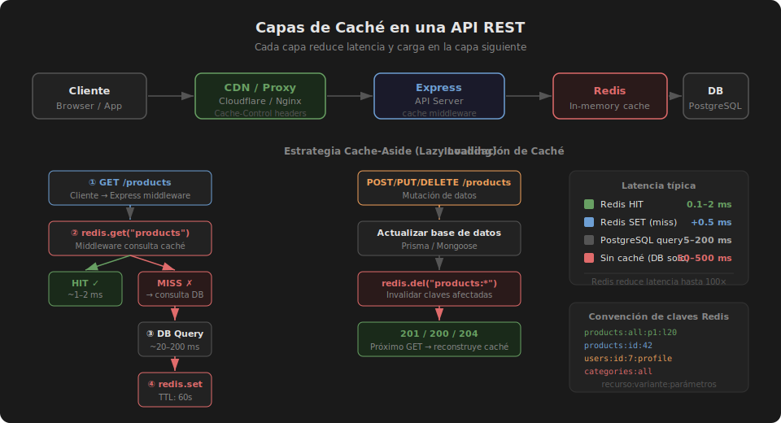

# Caché con Express y Redis

## 🎯 Objetivos

- Implementar un middleware de caché HTTP genérico sobre Express
- Aplicar la estrategia **cache-aside** (lazy loading)
- Invalidar caché cuando los datos cambian (POST/PUT/DELETE)
- Entender qué headers HTTP están relacionados con la caché

---

## 1. Estrategias de caché

### Cache-aside (Lazy Loading)

Es la estrategia más común en APIs REST. El servidor busca en caché primero
y solo consulta la base de datos si no encuentra nada.

```
GET /products
   ↓
Middleware comprueba Redis
   ↓           ↓
HIT: 1ms    MISS: consulta BD → guarda en Redis → responde
```

```typescript
// Pseudocódigo del flujo
async function cacheAside(key: string, ttl: number, fetchFn: () => Promise<unknown>) {
  // 1. Buscar en caché
  const cached = await redis.get(key);
  if (cached) return JSON.parse(cached);

  // 2. Cache miss → consultar fuente de verdad
  const data = await fetchFn();

  // 3. Guardar resultado en caché para próximas peticiones
  await redis.set(key, JSON.stringify(data), 'EX', ttl);

  return data;
}
```

### Write-through

En esta estrategia, cada escritura actualiza simultáneamente la BD y la caché.
Garantiza consistencia pero añade latencia en escrituras.

```typescript
// Crear recurso → actualizar en BD y caché al mismo tiempo
const product = await db.product.create({ data });
await redis.set(`products:id:${product.id}`, JSON.stringify(product), 'EX', 120);
```

---

## 2. Middleware de caché HTTP

Un middleware bien diseñado intercepta la respuesta antes de enviarla al cliente
y la guarda en Redis para futuras peticiones.

```typescript
// src/middlewares/cache.middleware.ts
import { Request, Response, NextFunction } from 'express';
import { redis } from '../lib/redis';

interface CacheOptions {
  ttl?: number;         // segundos
  keyFn?: (req: Request) => string; // función para generar la clave
}

export function cacheMiddleware(options: CacheOptions = {}) {
  const { ttl = 60, keyFn } = options;

  return async (req: Request, res: Response, next: NextFunction) => {
    // Solo cachear GET
    if (req.method !== 'GET') return next();

    const key = keyFn
      ? keyFn(req)
      : `cache:${req.path}:${JSON.stringify(req.query)}`;

    try {
      const cached = await redis.get(key);

      if (cached) {
        // Cache HIT: responder directamente
        res.setHeader('X-Cache', 'HIT');
        return res.json(JSON.parse(cached));
      }

      // Cache MISS: interceptar res.json para guardar la respuesta
      res.setHeader('X-Cache', 'MISS');
      const originalJson = res.json.bind(res);

      res.json = (body: unknown) => {
        // Guardar en Redis de forma no bloqueante
        redis.set(key, JSON.stringify(body), 'EX', ttl).catch((err) => {
          console.error('Cache set error:', err.message);
        });
        return originalJson(body);
      };

      next();
    } catch (err) {
      // Si Redis falla, continuar sin caché (degradado gracioso)
      console.error('Cache middleware error:', (err as Error).message);
      next();
    }
  };
}
```

### Uso en rutas

```typescript
// src/routes/product.routes.ts
import { Router } from 'express';
import { cacheMiddleware } from '../middlewares/cache.middleware';
import * as productController from '../controllers/product.controller';

const router = Router();

// Cache de 5 minutos para listado
router.get('/', cacheMiddleware({ ttl: 300 }), productController.getAll);

// Cache de 2 minutos para detalle
router.get(
  '/:id',
  cacheMiddleware({
    ttl: 120,
    keyFn: (req) => `cache:products:id:${req.params.id}`,
  }),
  productController.getById,
);

export { router as productRouter };
```

---

## 3. Invalidación de caché

Cuando los datos cambian, la caché debe invalidarse para no servir datos obsoletos.

```typescript
// src/services/product.service.ts
import { redis } from '../lib/redis';

export async function createProduct(data: CreateProductDto) {
  const product = await db.product.create({ data });

  // Invalidar caché del listado al crear uno nuevo
  await redis.del('cache:/api/v1/products:{}');

  return product;
}

export async function updateProduct(id: string, data: UpdateProductDto) {
  const product = await db.product.update({ where: { id }, data });

  // Invalidar caché del recurso actualizado y del listado
  await invalidateProductCache(id);

  return product;
}

export async function deleteProduct(id: string) {
  await db.product.delete({ where: { id } });
  await invalidateProductCache(id);
}

// Función auxiliar de invalidación
async function invalidateProductCache(id?: string) {
  const keysToDelete: string[] = [];

  // Invalidar el listado siempre
  const listKeys = await redis.keys('cache:/api/v1/products:*');
  keysToDelete.push(...listKeys);

  // Invalidar el detalle si se proporciona ID
  if (id) keysToDelete.push(`cache:products:id:${id}`);

  if (keysToDelete.length > 0) {
    // unlink es no bloqueante (equivalente async de DEL)
    await redis.unlink(...keysToDelete);
  }
}
```

---

## 4. Headers HTTP relacionados con caché

El header `X-Cache` que añadimos es un header de diagnóstico personalizado.
Los headers estándar que controlan la caché del cliente y proxies son:

| Header | Descripción | Ejemplo |
|--------|-------------|---------|
| `Cache-Control` | Directivas de caché | `max-age=300, public` |
| `ETag` | Hash del contenido para validación | `"abc123"` |
| `Last-Modified` | Fecha de última modificación | `Wed, 21 Oct 2015 07:28:00 GMT` |
| `Vary` | Qué headers afectan la caché del proxy | `Accept-Encoding` |

```typescript
// Agregar Cache-Control en respuestas cacheadas
res.setHeader('Cache-Control', `public, max-age=${ttl}`);
res.setHeader('X-Cache', 'HIT');
```

---

## ✅ Checklist de verificación

- [ ] Middleware de caché intercepta solo métodos GET
- [ ] Header `X-Cache: HIT` o `X-Cache: MISS` visible en respuestas
- [ ] Si Redis falla, la API sigue funcionando (sin lanzar error 500)
- [ ] POST/PUT/DELETE invalidan las claves afectadas
- [ ] TTL diferente para listados vs detalles

---

## 📚 Recursos adicionales

- [Caching best practices (Google Web Fundamentals)](https://web.dev/articles/http-cache)
- [Redis caching patterns](https://redis.io/docs/latest/develop/use/patterns/)


