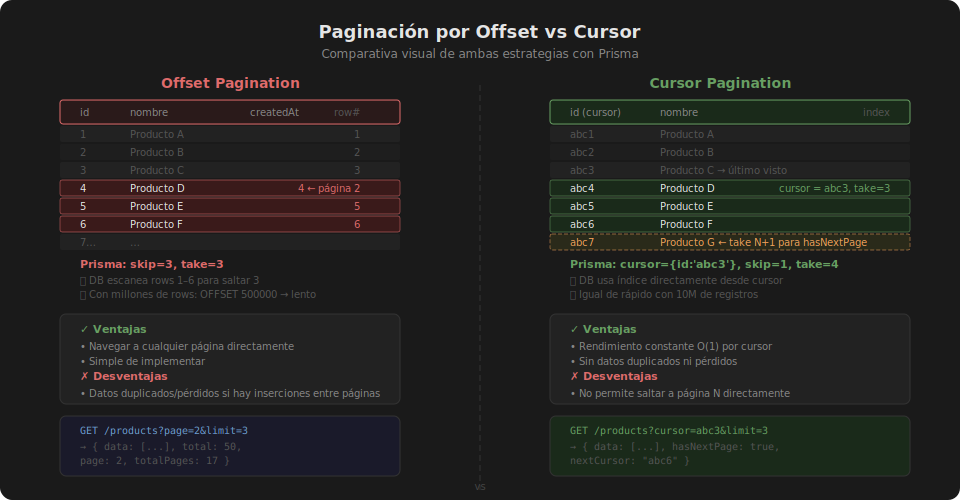

# Paginación Eficiente

## 🎯 Objetivos

- Entender las limitaciones de la paginación por offset a gran escala
- Implementar paginación por **cursor** con Prisma
- Retornar metadatos de paginación: `hasNextPage`, `nextCursor`, `total`
- Validar parámetros de paginación con Zod

---

## 1. El problema del offset a gran escala

La paginación por offset usa `LIMIT` y `OFFSET` en SQL:

```sql
SELECT * FROM products ORDER BY id OFFSET 10000 LIMIT 20;
```

El problema: PostgreSQL debe **leer y descartar** los primeros 10.000 registros
antes de llegar a los 20 que queremos. A medida que crece la tabla, esto se vuelve
cada vez más lento.

```
Tabla con 1,000,000 filas:
  OFFSET 10       → ~5 ms   ✓
  OFFSET 100,000  → ~200 ms ⚠️
  OFFSET 900,000  → ~2s     ✗
```

Además, si alguien inserta o elimina filas entre páginas, puedes ver el mismo
dato dos veces o saltarte uno.

---

## 2. Paginación por offset con Prisma

A pesar de sus limitaciones, la paginación por offset es apropiada para:
- Tablas pequeñas (< 100.000 filas)
- Administración donde el usuario navega a páginas numéricas

```typescript
// src/services/product.service.ts
interface OffsetPaginationResult<T> {
  data: T[];
  total: number;
  page: number;
  limit: number;
  totalPages: number;
}

export async function findAllPaginated(
  page: number,
  limit: number,
): Promise<OffsetPaginationResult<Product>> {
  const skip = (page - 1) * limit;

  // Ejecutar las dos queries en paralelo para mejor rendimiento
  const [data, total] = await Promise.all([
    prisma.product.findMany({
      skip,
      take: limit,
      orderBy: { createdAt: 'desc' },
    }),
    prisma.product.count(),
  ]);

  return {
    data,
    total,
    page,
    limit,
    totalPages: Math.ceil(total / limit),
  };
}
```

---

## 3. Paginación por cursor con Prisma

El cursor apunta al último elemento visto. La siguiente página comienza
a partir de ese punto usando el índice, sin saltar filas.

### Truco del N+1

Para saber si hay más páginas, pedimos **`take + 1`** elementos.
Si obtenemos más de `take`, hay página siguiente.

```typescript
// src/services/product.service.ts
interface CursorPaginationResult<T> {
  data: T[];
  hasNextPage: boolean;
  nextCursor: string | null;
}

export async function findAllWithCursor(
  limit: number,
  cursor?: string,
): Promise<CursorPaginationResult<Product>> {
  // Pedir un elemento extra para detectar hasNextPage
  const take = limit + 1;

  const items = await prisma.product.findMany({
    take,
    // Si hay cursor, empezar después de ese elemento
    ...(cursor && {
      cursor: { id: cursor },
      skip: 1, // saltarse el cursor mismo
    }),
    orderBy: { createdAt: 'desc' },
  });

  const hasNextPage = items.length > limit;

  // Si hay más, el nextCursor es el ID del último elemento real
  const data = hasNextPage ? items.slice(0, limit) : items;
  const nextCursor = hasNextPage ? data[data.length - 1].id : null;

  return { data, hasNextPage, nextCursor };
}
```

### Respuesta del endpoint

```json
{
  "data": [
    { "id": "abc6", "name": "Producto F", "price": 29.99 },
    { "id": "abc5", "name": "Producto E", "price": 14.99 },
    { "id": "abc4", "name": "Producto D", "price": 9.99 }
  ],
  "hasNextPage": true,
  "nextCursor": "abc4"
}
```

El cliente llama a la siguiente página con:
```
GET /products?cursor=abc4&limit=3
```

---

## 4. Validar parámetros con Zod

```typescript
// src/validators/pagination.schema.ts
import { z } from 'zod';

export const offsetPaginationSchema = z.object({
  page: z.coerce.number().int().positive().default(1),
  limit: z.coerce.number().int().min(1).max(100).default(20),
});

export const cursorPaginationSchema = z.object({
  cursor: z.string().optional(),
  limit: z.coerce.number().int().min(1).max(100).default(20),
});

export type OffsetPaginationQuery = z.infer<typeof offsetPaginationSchema>;
export type CursorPaginationQuery = z.infer<typeof cursorPaginationSchema>;
```

```typescript
// src/controllers/product.controller.ts
import { cursorPaginationSchema } from '../validators/pagination.schema';

export async function getAll(req: Request, res: Response, next: NextFunction) {
  try {
    const query = cursorPaginationSchema.parse(req.query);
    const result = await productService.findAllWithCursor(query.limit, query.cursor);
    res.json(result);
  } catch (err) {
    next(err);
  }
}
```

---

## 5. Cuándo usar cada estrategia

| Criterio | Offset | Cursor |
|----------|--------|--------|
| Tabla < 50K filas | ✓ | ✓ |
| Tabla > 500K filas | ✗ | ✓ |
| Navegar a página N | ✓ | ✗ |
| Scroll infinito / feed | ✗ | ✓ |
| Datos se insertan frecuentemente | ✗ | ✓ |
| Necesitas `totalPages` | ✓ | ✗ |

---

## ✅ Checklist de verificación

- [ ] `cursor` + `skip: 1` en Prisma para no incluir el cursor en resultados
- [ ] `take = limit + 1` para detectar `hasNextPage`
- [ ] `data.slice(0, limit)` para no devolver el elemento extra
- [ ] `nextCursor` es `null` en la última página
- [ ] Parámetros validados con Zod (`coerce.number()` para query strings)


