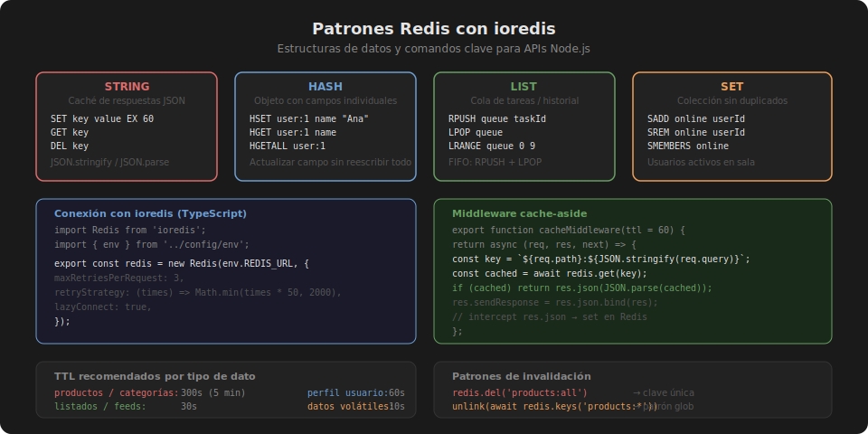

# Compresión y Performance HTTP

## 🎯 Objetivos

- Aplicar compresión **gzip/brotli** con el middleware `compression`
- Entender qué respuestas vale la pena comprimir
- Configurar ETags para caché condicional
- Medir el impacto de la caché y la compresión

---

## 1. Compresión HTTP

Cuando el cliente envía `Accept-Encoding: gzip, br` en el request,
el servidor puede comprimir la respuesta antes de enviarla.
El cliente la descomprime automáticamente.

```
Sin compresión:  JSON de 50KB → 50KB enviados por la red
Con gzip:        JSON de 50KB → ~8KB enviados por la red  (84% menos)
Con brotli:      JSON de 50KB → ~6KB enviados por la red  (88% menos)
```

### Instalar y configurar `compression`

```bash
pnpm add compression@1.8.0
pnpm add -D @types/compression@1.7.5
```

```typescript
// src/app.ts
import express from 'express';
import compression from 'compression';

const app = express();

// Añadir antes de los routers
app.use(compression({
  // Solo comprimir respuestas > 1KB (por defecto 1024 bytes)
  threshold: 1024,
  // Nivel de compresión: 1 (rápido) a 9 (máxima compresión)
  // 6 es el balance recomendado
  level: 6,
  // No comprimir imágenes (ya están comprimidas)
  filter: (req, res) => {
    const contentType = res.getHeader('Content-Type') as string;
    if (contentType && contentType.startsWith('image/')) return false;
    return compression.filter(req, res);
  },
}));
```

### Verificar que funciona

```bash
curl -H "Accept-Encoding: gzip" -I http://localhost:3000/api/v1/products
# Content-Encoding: gzip  ← indica que la respuesta está comprimida
```

---

## 2. ¿Qué vale la pena comprimir?

| Tipo de contenido | ¿Comprimir? | Razón |
|-------------------|-------------|-------|
| JSON (API responses) | ✓ | Alto ratio de compresión |
| HTML / CSS / JS | ✓ | Alto ratio de compresión |
| Texto plano | ✓ | Alto ratio de compresión |
| JPEG / PNG / WebP | ✗ | Ya están comprimidas |
| PDF | ✗ | Ya está comprimido |
| Respuestas < 1KB | ✗ | Overhead mayor que beneficio |

---

## 3. ETags y caché condicional

Un **ETag** es un hash del contenido de la respuesta.
Express genera ETags automáticamente. El cliente los usa para hacer
peticiones condicionales:

```
Primer request:
  → GET /products
  ← 200 OK  ETag: "abc123"  (respuesta completa, ~50KB)

Segundo request del mismo cliente:
  → GET /products  If-None-Match: "abc123"
  ← 304 Not Modified  (sin body, 0 bytes)   ← ¡el cliente usa su caché local!
```

```typescript
// Express activa ETags por defecto. Para desactivarlos:
app.set('etag', false);

// Para usar ETags débiles (menos estrictos):
app.set('etag', 'weak');
```

```typescript
// En un controlador puedes verificar manualmente:
export async function getProduct(req: Request, res: Response) {
  const product = await productService.findById(req.params.id);
  if (!product) return res.status(404).json({ message: 'Not found' });

  // Express compara automáticamente el ETag y retorna 304 si no cambió
  res.json(product);
}
```

---

## 4. Medir el impacto de caché y compresión

### Con `curl` y tiempo de respuesta

```bash
# Sin caché (primera petición)
time curl -s http://localhost:3000/api/v1/products > /dev/null
# real  0m0.185s

# Con caché (segunda petición)
time curl -s http://localhost:3000/api/v1/products > /dev/null
# real  0m0.003s  ← 60x más rápido
```

### Con header `X-Response-Time`

```bash
pnpm add response-time@2.3.3
pnpm add -D @types/response-time@2.3.8
```

```typescript
import responseTime from 'response-time';

app.use(responseTime((req, res, time) => {
  // Agrega X-Response-Time: 12.345ms al header
  res.setHeader('X-Response-Time', `${time.toFixed(3)}ms`);
}));
```

### Con ApacheBench (ab)

```bash
# Instalar: sudo apt install apache2-utils
# 1000 requests, 10 concurrentes
ab -n 1000 -c 10 http://localhost:3000/api/v1/products

# Resultados relevantes:
# Requests per second:    2345 [#/sec]
# Time per request:       0.426 [ms]
# Transfer rate:          1234 [Kbytes/sec]
```

---

## 5. Resumen de configuración recomendada

```typescript
// src/app.ts — configuración de performance completa
import express from 'express';
import compression from 'compression';
import helmet from 'helmet';

const app = express();

// 1. Seguridad primero
app.use(helmet());

// 2. Compresión de respuestas
app.use(compression({ threshold: 1024, level: 6 }));

// 3. ETags habilitados por defecto en Express (no hace falta activar)

// 4. Caché de archivos estáticos si sirves assets
app.use('/static', express.static('public', { maxAge: '7d' }));
```

---

## ✅ Checklist de verificación

- [ ] `compression` middleware instalado y antes de los routers
- [ ] `curl -H "Accept-Encoding: gzip"` retorna `Content-Encoding: gzip`
- [ ] Respuestas de texto/JSON menores a 1KB no se comprimen (umbral correcto)
- [ ] ETags habilitados (comportamiento por defecto en Express)
- [ ] `X-Response-Time` o logs muestran diferencia de latencia con/sin caché

---

## 📚 Recursos adicionales

- [compression npm docs](https://www.npmjs.com/package/compression)
- [MDN — Content-Encoding](https://developer.mozilla.org/en-US/docs/Web/HTTP/Headers/Content-Encoding)
- [MDN — ETag](https://developer.mozilla.org/en-US/docs/Web/HTTP/Headers/ETag)


