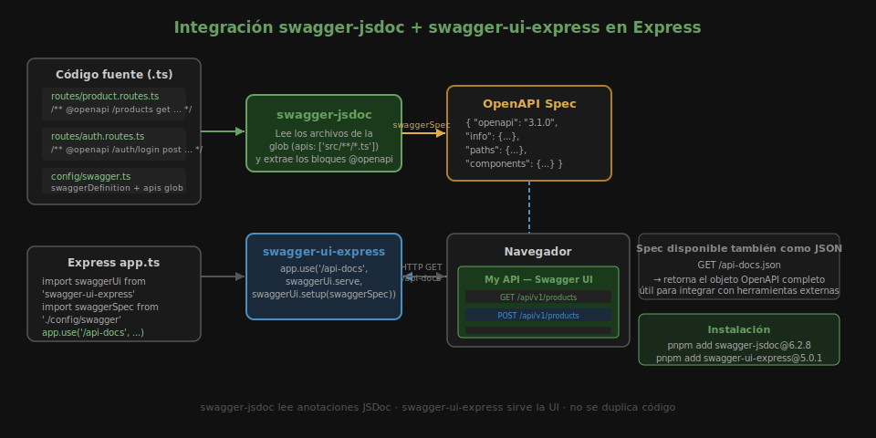

# Ejercicio 01 — Swagger Básico

Partirás de una API CRUD de productos en memoria completamente funcional.
Tu tarea es **agregar documentación OpenAPI** paso a paso.



---

## 🛠️ Setup

```bash
cd starter
pnpm install
cp .env.example .env
pnpm dev
```

Verifica que la API funcione en `http://localhost:3000/api/v1/products`.

---

## PASO 1 — Configurar swagger-jsdoc

**Abre `starter/src/config/swagger.ts`** y descomenta la sección del PASO 1.

Configuras:
- `openapi: '3.1.0'`, `info`, `servers` con el puerto del `.env`
- `apis: ['./src/routes/*.ts']` — glob para que swagger-jsdoc lea los @openapi

Verifica: `pnpm dev` no arroja errores de TypeScript.

---

## PASO 2 — Montar Swagger UI en app.ts

**Abre `starter/src/app.ts`** y descomenta la sección del PASO 2.

Registras:
- `app.use('/api-docs', swaggerUi.serve, swaggerUi.setup(swaggerSpec))`
- `app.get('/api-docs.json', ...)` para exponer la spec como JSON

Verifica: abre `http://localhost:3000/api-docs` → debe aparecer Swagger UI
con el título "Products API" pero **sin endpoints documentados todavía**.

---

## PASO 3 — Documentar GET /products y GET /products/:id

**Abre `starter/src/routes/product.routes.ts`** y descomenta la sección del PASO 3.

Cada endpoint incluye:
- `tags: [Products]`
- `summary`
- `parameters` (solo `/:id` necesita `in: path`)
- `responses` con codes `200` y `404`

Verifica: recarga Swagger UI → deben aparecer dos operaciones GET bajo el
tag **Products**. Haz clic en **Try it out** → **Execute** y confirma que
retorna los productos correctamente.

---

## PASO 4 — Documentar POST /products y DELETE /products/:id

**Abre `starter/src/routes/product.routes.ts`** y descomenta la sección del PASO 4.

El `POST` incluye:
- `requestBody` con `content: application/json` y schema inline
- Respuestas `201` y `400`

El `DELETE` incluye:
- Parámetro `id` en path
- Respuesta `204` (sin `content`) y `404`

Verifica: en Swagger UI aparecen `POST` y `DELETE`. Prueba crear un producto
desde **Try it out** y luego elimínalo con su `id`.

---

## ✅ Criterios de éxito

- `GET /api-docs` carga Swagger UI sin errores
- Los 4 endpoints aparecen en la UI con summary y responses
- `GET /api-docs.json` retorna la spec completa en JSON
- **Try it out** funciona para crear y eliminar productos
