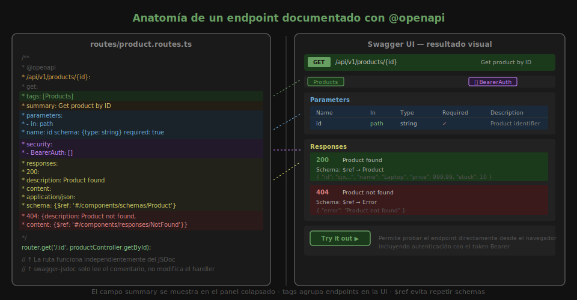

# Ejercicio 02 — OpenAPI: Schemas, Seguridad y Tags

Partirás de una API de items con autenticación JWT (ya funcional).
Tu tarea es completar la documentación OpenAPI con **schemas reutilizables**,
**BearerAuth** y **tags** organizados.



---

## 🛠️ Setup

```bash
cd starter
pnpm install
cp .env.example .env
pnpm dev
```

La API tiene endpoints públicos (login) y protegidos (crear/eliminar items).
Verifica que `POST /api/v1/auth/login` retorna un token JWT.

---

## PASO 1 — Definir schemas en components

**Abre `starter/src/config/swagger.ts`** y descomenta la sección del PASO 1.

Defines en `components.schemas`:
- `Item`: schema del recurso principal (id, name, price, stock)
- `Error`: schema de error genérico (`{ error: string }`)
- `CreateItemDto`: schema de creación (name requerido, price y stock opcionales)
- `LoginDto`: schema para el body de login

Verifica: `GET /api-docs.json` → debe incluir una clave `components.schemas`
con los cuatro schemas.

---

## PASO 2 — Configurar BearerAuth security scheme

**Abre `starter/src/config/swagger.ts`** y descomenta la sección del PASO 2.

Defines en `components.securitySchemes`:
- `BearerAuth` de tipo `http`, esquema `bearer`, formato `JWT`

Verifica: en Swagger UI aparece el botón **Authorize** (🔒) en la parte
superior. Al hacer clic, puedes ingresar un token Bearer.

---

## PASO 3 — Aplicar security a rutas protegidas

**Abre `starter/src/routes/item.routes.ts`** y descomenta la sección del PASO 3.

Para cada endpoint protegido (`POST /items`, `DELETE /items/:id`) agrega:
```yaml
security:
  - BearerAuth: []
```

Para los endpoints **públicos** (`GET /items`, `GET /items/:id`, `POST /auth/login`)
agrega `security: []` para indicar que no requieren token.

Verifica:
1. Haz login en Swagger UI → copia el token → haz clic en **Authorize** → pega
2. Intenta `POST /items` → debe funcionar con el token
3. Cierra el modal → intenta de nuevo → debe fallar con 401

---

## PASO 4 — Organizar con tags (bonus)

Agrega `tags: [Auth]` a los endpoints de autenticación y `tags: [Items]` a
los del recurso. Swagger UI debe mostrar dos grupos separados con acordeones.

---

## ✅ Criterios de éxito

- Swagger UI muestra cuatro schemas en la sección **Schemas**
- El botón **Authorize** aparece y funciona para endpoints protegidos
- Las rutas públicas no muestran el candado 🔒 en Swagger UI
- Los endpoints están agrupados en tags **Items** y **Auth**
- `$ref` se usa en lugar de schemas inline en todos los endpoints
