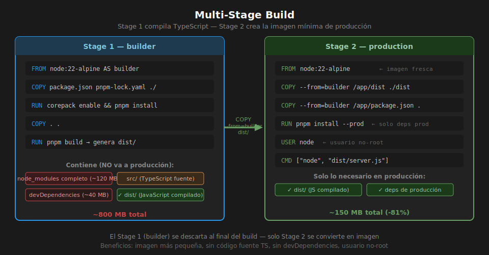

# Multi-Stage Builds

## 🎯 Objetivos

- Reducir el tamaño de la imagen de producción con builds multi-stage
- Implementar `USER` non-root para mayor seguridad
- Agregar `HEALTHCHECK` a la imagen

---

## 1. El problema del Dockerfile de un solo stage

Un Dockerfile estándar para TypeScript incluye en la imagen final:

- Compilador TypeScript (`ts-node-dev`, `tsc`)
- Todas las `devDependencies` (~40 MB+)
- Código fuente `.ts` (el usuario no debería tener acceso en prod)
- `node_modules` completo (~120-200 MB)

La imagen resultante puede pesar **~700-900 MB**.
En producción solo necesitamos: **el código compilado + las dependencias de producción**.



---

## 2. Dockerfile multi-stage

```dockerfile
# ─────────────────────────────────────────────
# Stage 1: builder
# Instala todas las deps y compila TypeScript
# ─────────────────────────────────────────────
FROM node:22-alpine AS builder

WORKDIR /app
RUN corepack enable

# Layer caching: deps primero
COPY package.json pnpm-lock.yaml ./
RUN pnpm install --frozen-lockfile

# Copiar fuente y compilar
COPY . .
RUN pnpm build

# ─────────────────────────────────────────────
# Stage 2: production
# Solo lo necesario para ejecutar la app
# ─────────────────────────────────────────────
FROM node:22-alpine AS production

WORKDIR /app
RUN corepack enable

# Copiar SOLO artefactos del stage builder
COPY --from=builder /app/dist ./dist
COPY --from=builder /app/package.json ./
COPY --from=builder /app/pnpm-lock.yaml ./

# Instalar solo dependencias de producción (sin devDeps)
RUN pnpm install --prod --frozen-lockfile

# ── Seguridad: usuario no-root ────────────────
# La imagen oficial node:22-alpine trae un usuario 'node' con UID 1000.
# Correr como root en un contenedor es un riesgo de seguridad.
USER node

EXPOSE 3000

# ── Health check ──────────────────────────────
# Docker verifica cada 30s que la app responde.
# Útil para docker-compose depends_on y orchestrators (Kubernetes).
HEALTHCHECK --interval=30s --timeout=5s --start-period=10s --retries=3 \
  CMD wget -qO- http://localhost:3000/health || exit 1

CMD ["node", "dist/server.js"]
```

---

## 3. Comparativa de tamaños

| Dockerfile | Tamaño aprox. | Contiene código fuente TS |
|------------|--------------|--------------------------|
| Single-stage | ~800 MB | Sí (riesgo en prod) |
| Multi-stage | ~150 MB | No ✓ |

```bash
# Verificar tamaños después de hacer los builds
docker images | grep mi-api
```

---

## 4. ARG vs ENV

```dockerfile
# ARG: solo disponible durante el build
# Útil para versiones, fechas, credenciales de build
ARG NODE_ENV=production
ARG BUILD_DATE

# ENV: disponible durante build Y en el contenedor en runtime
# Útil para configuración de la aplicación
ENV NODE_ENV=${NODE_ENV}
ENV PORT=3000
```

**Regla de seguridad**: si el valor es un secreto (API key, contraseña),
**no uses ARG ni ENV en el Dockerfile**. Pásalo en runtime con `--env-file`
o en docker-compose con `env_file`.

Los ARGs se pueden ver en `docker history` — no son seguros para secretos.

---

## 5. HEALTHCHECK

```dockerfile
# Sintaxis
HEALTHCHECK [opciones] CMD <comando>

# Opciones importantes
# --interval=30s    ← frecuencia de la verificación
# --timeout=5s      ← tiempo máximo de una verificación
# --start-period=10s ← tiempo de gracia al arrancar
# --retries=3       ← fallos consecutivos antes de marcar unhealthy

# Ejemplo con wget (Alpine no tiene curl por defecto)
HEALTHCHECK --interval=30s --timeout=5s --start-period=10s --retries=3 \
  CMD wget -qO- http://localhost:3000/health || exit 1

# Ejemplo instalando curl primero
RUN apk add --no-cache curl
HEALTHCHECK CMD curl -f http://localhost:3000/health || exit 1
```

**Por qué es importante**: docker-compose puede usar el health check para
esperar a que un servicio esté realmente listo antes de arrancar otro.

---

## 6. Copiar Prisma client (si aplica)

Si usas Prisma, necesitas copiar también el schema y regenerar el client:

```dockerfile
# En el stage production, después de instalar deps:
COPY --from=builder /app/prisma ./prisma
RUN pnpm prisma generate
```

---

## ✅ Checklist de Verificación

- [ ] `--from=builder` copia solo `dist/`, `package.json`, `pnpm-lock.yaml`
- [ ] Stage production usa `RUN pnpm install --prod`
- [ ] `USER node` presente en el stage de producción
- [ ] `HEALTHCHECK` configurado con endpoint `/health`
- [ ] Imagen final pesa menos de 250 MB (`docker images`)
- [ ] No hay código fuente `.ts` en la imagen final (`docker exec ... ls`)
