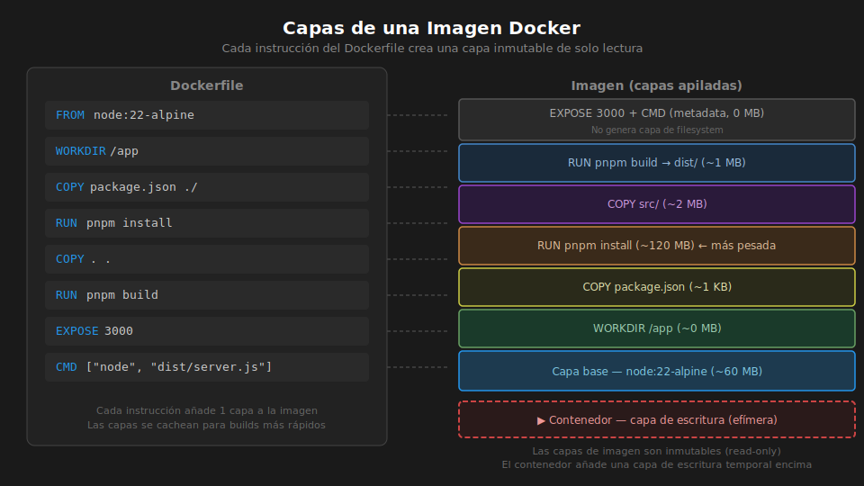

# Ejercicio 01 — Dockerfile: Single-stage y Multi-stage

Partirás de una API Express + TypeScript funcional (en memoria, sin base de datos).
Tu tarea es escribir el `Dockerfile` y el `.dockerignore` para contenerizarla.



---

## 🛠️ Setup

```bash
cd starter
pnpm install
pnpm dev
# Verifica: GET http://localhost:3000/health → { "status": "ok" }
```

---

## PASO 1 — Dockerfile single-stage

**Abre `starter/Dockerfile`** y descomenta el bloque del PASO 1.

El Dockerfile debe:
1. Partir de `node:22-alpine`
2. Habilitar pnpm via `corepack enable`
3. Copiar `package.json` y `pnpm-lock.yaml` ANTES que el código fuente
4. Ejecutar `pnpm install --frozen-lockfile`
5. Copiar el código fuente
6. Ejecutar `pnpm build`
7. Exponer el puerto 3000
8. Definir `CMD ["node", "dist/server.js"]`

Construye y verifica:
```bash
docker build -t ejercicio-01:single .
docker run -d -p 3000:3000 --name api-test ejercicio-01:single
curl http://localhost:3000/health
docker rm -f api-test
```

---

## PASO 2 — .dockerignore

**Abre `starter/.dockerignore`** y descomenta el contenido del PASO 2.

El archivo debe excluir al menos:
- `node_modules` — se instalan dentro de la imagen
- `.env` y `.env.*` — nunca dentro de una imagen
- `dist` — se genera con `pnpm build` dentro de la imagen
- `.git` — innecesario en la imagen

Verifica que el tamaño del contexto de build disminuye:
```bash
docker build -t ejercicio-01:single .
# En la salida de docker build debe aparecer el tamaño del contexto
```

---

## PASO 3 — Dockerfile multi-stage

**Abre `starter/Dockerfile`** y comenta el bloque del PASO 1. Luego
descomenta el bloque del PASO 3 (multi-stage).

El Dockerfile debe tener dos stages:
- `builder`: instala todas las deps y compila TypeScript
- `production`: imagen fresca, copia solo `dist/`, instala solo prod deps, usa `USER node`

Construye y compara:
```bash
docker build -t ejercicio-01:multi .
docker images | grep ejercicio-01

# Resultado esperado:
# ejercicio-01  multi    ...   ~150 MB
# ejercicio-01  single   ...   ~700 MB
```

---

## PASO 4 — Health check y verificación final

Agrega `HEALTHCHECK` al stage production del multi-stage Dockerfile:
```dockerfile
HEALTHCHECK --interval=30s --timeout=5s --start-period=10s --retries=3 \
  CMD wget -qO- http://localhost:3000/health || exit 1
```

Ejecuta el contenedor y verifica el health check:
```bash
docker run -d -p 3000:3000 --name api-final ejercicio-01:multi

# Espera ~15 segundos y luego:
docker ps
# Debe aparecer "(healthy)" en la columna STATUS
```

---

## ✅ Criterios de éxito

- `docker build` sin errores en ambas variantes
- Imagen multi-stage pesa menos de 200 MB
- `curl http://localhost:3000/health` responde desde el contenedor
- `docker ps` muestra status `(healthy)` para el contenedor multi-stage
- La columna `docker images` muestra la diferencia de tamaño entre single y multi
