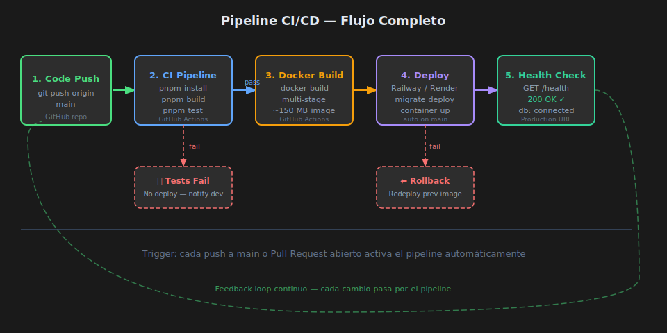

# CI/CD — Fundamentos

## 🎯 Objetivos

- Entender qué es CI y qué es CD y por qué se usan juntos
- Conocer las etapas de un pipeline profesional
- Comprender trunk-based development como estrategia de trabajo

---

## 1. ¿Qué es CI/CD?

**CI (Continuous Integration)** y **CD (Continuous Deployment)** son prácticas
de ingeniería de software que automatizan la integración y el despliegue de código.

| Práctica | Hace automáticamente | Cuándo |
|----------|---------------------|--------|
| **CI** | Instalar deps, compilar, testear | En cada push o PR |
| **CD** | Construir imagen, desplegar | Cuando el pipeline CI pasa en main |

El objetivo es detectar errores lo antes posible y reducir el riesgo de cada deploy.

```
Sin CI/CD:
  código → git push → deploy manual → "funciona en mi máquina" → bug en prod

Con CI/CD:
  código → git push → pipeline automático → errores detectados antes de prod
```

---

## 2. Etapas de un Pipeline Profesional



### Etapas típicas

| Etapa | Herramienta | Objetivo |
|-------|------------|----------|
| **Lint** | ESLint, tsc | Detectar errores de estilo y tipo |
| **Test** | Jest + Supertest | Verificar comportamiento funcional |
| **Build** | `tsc`, `docker build` | Generar artefactos de producción |
| **Deploy** | Railway, Render, AWS | Publicar la nueva versión |
| **Health check** | `GET /health` | Confirmar que la app arrancó bien |

### Regla de oro: si el pipeline falla, no se despliega

El CD solo se ejecuta si CI pasa completamente. Esto garantiza que solo
el código verificado llega a producción.

---

## 3. Trunk-Based Development

Es la estrategia de branching más compatible con CI/CD:

- Existe una sola rama principal (`main`)
- Los desarrolladores hacen branches de vida corta (horas, no días)
- Se integra a `main` via Pull Request con aprobación y CI verde
- No hay ramas `develop`, `staging` o similares de larga vida

```
main ──────────────────────────────────────►
       │    ↑         │    ↑
  feature/A  merge  feature/B  merge
  (PR + CI)          (PR + CI)
```

---

## 4. Beneficios Concretos

| Sin CI/CD | Con CI/CD |
|-----------|----------|
| Tests olvidados en deploys de urgencia | Tests siempre corren |
| "Funciona en mi máquina" | Entorno de CI reproducible |
| Deploy es un evento de alto riesgo | Deploy es rutinario y pequeño |
| Bugs detectados por usuarios | Bugs detectados en minutos |
| Rollback manual y estresante | Redeploy de imagen anterior |

---

## 5. Conceptos de Seguridad en el Pipeline

- **Secretos**: Nunca en el código. Se almacenan en el proveedor de CI (GitHub Secrets) o en la plataforma de deploy (Railway env vars)
- **Principio de menor privilegio**: El pipeline solo tiene acceso a lo que necesita
- **Artefactos inmutables**: La imagen Docker construida en CI es exactamente la que se despliega en prod — nunca se construye en el servidor

---

## ✅ Checklist de Verificación

- [ ] Entiendo la diferencia entre CI y CD
- [ ] Sé qué dispara el pipeline (triggers)
- [ ] Entiendo por qué no se hacen commits directos a main en equipos
- [ ] Conozco el patrón de health check para verificar un deploy
