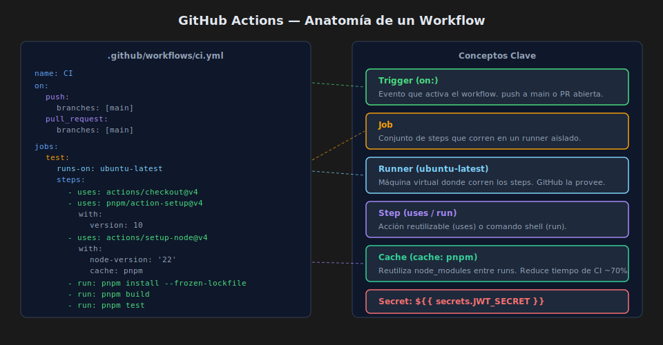

# GitHub Actions

## 🎯 Objetivos

- Crear y entender la estructura de un workflow de GitHub Actions
- Configurar triggers, jobs y steps correctamente
- Usar cache de dependencias para acelerar el pipeline
- Manejar secretos de forma segura

---

## 1. ¿Qué es GitHub Actions?

GitHub Actions es la plataforma de CI/CD integrada en GitHub. Los workflows
se definen en archivos YAML dentro de `.github/workflows/`.

```
.github/
└── workflows/
    ├── ci.yml          # Pipeline de tests (CI)
    └── deploy.yml      # Pipeline de deploy (CD) — opcional por separado
```



---

## 2. Estructura de un Workflow

```yaml
name: CI                      # Nombre visible en GitHub UI

on:                           # Triggers — cuándo se ejecuta
  push:
    branches: [main]
  pull_request:
    branches: [main]

jobs:                         # Conjunto de jobs paralelos o secuenciales
  test:                       # Nombre del job
    runs-on: ubuntu-latest    # Runner (máquina virtual de GitHub)
    steps:                    # Pasos secuenciales dentro del job
      - uses: actions/checkout@v4
      - name: Setup pnpm
        uses: pnpm/action-setup@v4
        with:
          version: 10
      - name: Setup Node.js
        uses: actions/setup-node@v4
        with:
          node-version: '22'
          cache: 'pnpm'
      - run: pnpm install --frozen-lockfile
      - run: pnpm build
      - run: pnpm test
```

### Campos clave

| Campo | Descripción |
|-------|------------|
| `name` | Nombre del workflow (aparece en GitHub UI) |
| `on` | Triggers: eventos que activan el workflow |
| `jobs` | Uno o más jobs que corren en paralelo por defecto |
| `runs-on` | Sistema operativo del runner (`ubuntu-latest`, `windows-latest`) |
| `uses` | Acción reutilizable del marketplace de GitHub |
| `run` | Comando shell que se ejecuta en el runner |

---

## 3. Triggers Comunes

```yaml
on:
  push:
    branches: [main]           # Push directo a main
  pull_request:
    branches: [main]           # PR contra main (para CI en branches)
  workflow_dispatch:           # Ejecución manual desde GitHub UI
  schedule:
    - cron: '0 8 * * 1'       # Lunes a las 8:00 UTC (tests de regresión)
```

---

## 4. Cache de dependencias

Sin cache, cada run instala todas las dependencias desde cero (~30-60 segundos).
Con cache, si `pnpm-lock.yaml` no cambió, se reutilizan los módulos (~5 segundos).

```yaml
- uses: pnpm/action-setup@v4
  with:
    version: 10

- uses: actions/setup-node@v4
  with:
    node-version: '22'
    cache: 'pnpm'            # ← activa el cache automáticamente
```

---

## 5. Variables de entorno y Secretos

### Variables de entorno normales (no secretas)

```yaml
jobs:
  test:
    env:
      NODE_ENV: test
      PORT: 3000
```

### Secretos (tokens, passwords, keys)

Los secretos se guardan en **GitHub → Settings → Secrets and variables → Actions**.
Nunca aparecen en logs ni son accesibles por PRs de forks externos.

```yaml
jobs:
  test:
    env:
      DATABASE_URL: ${{ secrets.DATABASE_URL_TEST }}
      JWT_SECRET: ${{ secrets.JWT_SECRET }}
```

---

## 6. Jobs secuenciales con needs

Por defecto los jobs corren en paralelo. Para encadenarlos:

```yaml
jobs:
  test:
    runs-on: ubuntu-latest
    steps:
      - run: pnpm test

  deploy:
    runs-on: ubuntu-latest
    needs: test              # ← deploy solo si test pasa
    if: github.ref == 'refs/heads/main'   # ← solo en main
    steps:
      - run: echo "Deploying..."
```

---

## 7. Workflow Completo: CI + Deploy en Railway

```yaml
name: CI/CD

on:
  push:
    branches: [main]
  pull_request:
    branches: [main]

jobs:
  test:
    runs-on: ubuntu-latest
    steps:
      - uses: actions/checkout@v4
      - uses: pnpm/action-setup@v4
        with:
          version: 10
      - uses: actions/setup-node@v4
        with:
          node-version: '22'
          cache: 'pnpm'
      - run: pnpm install --frozen-lockfile
      - run: pnpm build
      - run: pnpm test

  deploy:
    runs-on: ubuntu-latest
    needs: test
    if: github.ref == 'refs/heads/main'
    steps:
      - uses: actions/checkout@v4
      - name: Deploy to Railway
        uses: bervProject/railway-deploy@v1.0.0
        with:
          railway_token: ${{ secrets.RAILWAY_TOKEN }}
          service: my-api
```

---

## ✅ Checklist de Verificación

- [ ] El workflow está en `.github/workflows/ci.yml`
- [ ] Los triggers incluyen `push` a `main` y `pull_request`
- [ ] Se usa `pnpm/action-setup@v4` con versión fija (`version: 10`)
- [ ] El cache de pnpm está habilitado con `cache: pnpm`
- [ ] Los secretos usan `${{ secrets.NOMBRE }}`, no valores hardcodeados
- [ ] El job de deploy tiene `needs: test` para no desplegar si fallan los tests
