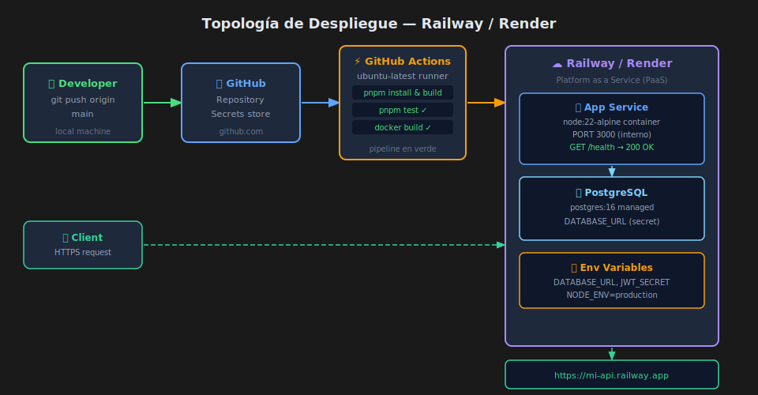

# Ejercicio 02 — Deployment en Railway/Render

En este ejercicio desplegarás la API del Ejercicio 01 (con CI funcionando)
en Railway o Render. La API tendrá una URL pública en producción.



---

## 🛠️ Prerrequisitos

- Ejercicio 01 completado (pipeline CI en verde)
- Cuenta en [Railway](https://railway.app) o [Render](https://render.com)
- La API subida a un repositorio público o privado en GitHub

---

## PASO 1 — Crear proyecto y conectar repositorio

### Railway

1. Dashboard → **New Project** → **Deploy from GitHub repo**
2. Selecciona tu repositorio del ejercicio-01
3. Railway detecta el `Dockerfile` automáticamente
4. El primer deploy arranca solo

### Render

1. Dashboard → **New** → **Web Service**
2. Conectar repositorio de GitHub
3. Seleccionar **Docker** como runtime
4. Render usa el `Dockerfile` de la raíz

Verifica en los logs que aparece:
```
🚀 API en http://localhost:XXXX
```

---

## PASO 2 — Variables de entorno

Agrega las siguientes variables en el panel de la plataforma:

| Variable | Valor |
|----------|-------|
| `NODE_ENV` | `production` |

**Para Railway**: Servicio → Variables → Add Variable
**Para Render**: Service → Environment → Add Environment Variable

Verifica haciendo curl a la URL pública:
```bash
curl https://tu-api.railway.app/health
# Esperado: {"status":"ok","uptime":...}
```

---

## PASO 3 — Deploy automático

Realiza un cambio mínimo en tu API (ej: agrega un campo en `/health`):

```ts
// src/app.ts — modifica el endpoint /health
app.get('/health', (_req, res) => {
  res.json({
    status: 'ok',
    uptime: process.uptime(),
    environment: process.env.NODE_ENV,   // ← nuevo campo
  });
});
```

Haz push a `main`:
```bash
git add .
git commit -m "feat: add environment to health check"
git push origin main
```

Verifica en Railway/Render que un nuevo deploy se dispara automáticamente
y en ~2 minutos la URL pública refleja el cambio.

---

## PASO 4 — Archivo de configuración

**Abre `starter/railway.json`** y completa con los datos de tu servicio.
Luego commitea y empuja.

El archivo configura el health check para que Railway verifique que la app
arrancó correctamente tras cada deploy.

---

## ✅ Criterios de éxito

- URL pública accesible: `https://mi-api.PLATAFORMA.app/health` → `200 OK`
- El campo `"status": "ok"` aparece en la respuesta
- Un push a `main` dispara un nuevo deploy automáticamente
- Los logs de la plataforma muestran el mensaje de arranque (`🚀 API en ...`)
- No hay secretos hardcodeados en el código — solo en el panel de la plataforma
