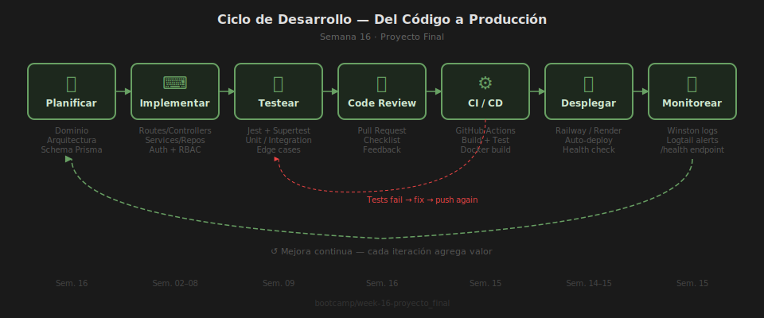

# Ejercicio 01 — Code Review: Encuentra y Corrige los Problemas

En este ejercicio revisarás una API Express con 4 problemas reales de código.
Cada PASO representa una clase de problema diferente. Aprenderás leyendo
el código problemático, entendiendo el por qué, y descomentando la corrección.



---

## ⚙️ Setup

```bash
cd starter
pnpm install
cp .env.example .env
pnpm dev
# API en http://localhost:3000
```

---

## PASO 1 — Validación de Inputs

**Problema**: La ruta `POST /products` acepta cualquier dato sin validar.
Enviar `{ "price": "no-es-numero" }` no da error — produce un registro corrupto.

**Abre `starter/src/routes/products.ts`** y descomenta el bloque del PASO 1.

Verifica:
```bash
# ❌ Antes: acepta datos inválidos
curl -X POST http://localhost:3000/products \
  -H "Content-Type: application/json" \
  -d '{"name": 123, "price": "abc"}'

# ✅ Después: retorna 400 con los errores de validación
# { "errors": { "name": "Expected string", "price": "Expected number" } }
```

---

## PASO 2 — Manejo de Errores

**Problema**: Si se pide `GET /products/id-inexistente`, Prisma lanza
`PrismaClientKnownRequestError P2025` y Express devuelve HTML (500) en lugar
de JSON `{ "error": "Product not found" }` con status 404.

**Abre `starter/src/app.ts`** y descomenta el bloque del PASO 2
(el error handler global al final del archivo).

Verifica:
```bash
# ❌ Antes: responde con HTML y stack trace
curl http://localhost:3000/products/id-que-no-existe

# ✅ Después: responde JSON 404
# { "error": "Product not found", "statusCode": 404 }
```

---

## PASO 3 — Seguridad HTTP

**Problema**: La API no tiene cabeceras de seguridad.
Un ataque `X-Powered-By: Express` revela el stack. CORS permite cualquier origen.

**Abre `starter/src/app.ts`** y descomenta el bloque del PASO 3
(helmet + cors + rate limiting).

Verifica haciendo inspect de las cabeceras de respuesta:
```bash
curl -I http://localhost:3000/products
# ✅ Debe incluir: X-Content-Type-Options, X-Frame-Options, etc.
# ✅ X-Powered-By NO debe aparecer
```

---

## PASO 4 — Arquitectura en Capas

**Problema**: El controller llama directamente a `prisma` sin pasar por un service.
Esto viola la separación de responsabilidades y hace imposible testear
la lógica de negocio sin una DB real.

**Abre `starter/src/controllers/products.controller.ts`** y descomenta
el bloque del PASO 4 que usa `productService` en lugar de llamar a Prisma directamente.

Verifica que sigue funcionando:
```bash
curl http://localhost:3000/products
# ✅ Misma respuesta, pero ahora la lógica está en el service
```

---

## ✅ Criterios de éxito

- PASO 1: `POST /products` con datos inválidos retorna `400` con cuerpo `{ errors }`
- PASO 2: `GET /products/:inexistente` retorna `404` en JSON
- PASO 3: Cabeceras de seguridad presentes en todas las respuestas
- PASO 4: El controller no importa `prisma` directamente
