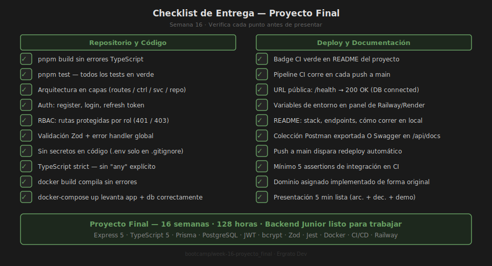

# 🚀 Proyecto Final — API REST Completa con tu Dominio Asignado

## 🎯 Objetivo

Construir una **API REST profesional y completa** integrando todos los conceptos
del bootcamp aplicados a tu dominio asignado. El resultado debe ser desplegable,
documentado y presentable como pieza de portafolio.



---

## 📋 Tu Dominio Asignado

**Dominio**: El instructor te asignará tu dominio específico.

El starter incluye un modelo genérico `Resource`. Debes renombrar y adaptar
todas las entidades a tu dominio (libros, medicamentos, miembros, platillos, etc.).

---

## 🛠️ Setup inicial

```bash
cd starter
pnpm install
cp .env.example .env           # Edita DATABASE_URL, JWT_SECRET, JWT_REFRESH_SECRET
pnpm prisma migrate dev --name init
pnpm dev
# API:    http://localhost:3000
# Docs:   http://localhost:3000/api/docs   (Swagger — opcional)
# Health: http://localhost:3000/health
```

Verifica que todo funciona:
```bash
curl http://localhost:3000/health
# { "status": "ok", "db": "connected", "uptime": ... }
```

---

## 📝 TODOs — Implementación por Etapas

### TODO 1 — Prisma Schema (adaptar a tu dominio)

**Archivo**: `starter/prisma/schema.prisma`

El schema tiene los modelos `User` y `Resource` genéricos. Debes:
1. Mantener `User` con `role: Role` (USER/ADMIN)
2. Renombrar `Resource` a tu entidad principal (ej: `Book`, `Medicine`, `Member`)
3. Agregar los campos específicos de tu dominio
4. Opcionalmente agregar una segunda entidad relacionada

Ejemplo para dominio Biblioteca:
```prisma
model Book {
  id          String   @id @default(cuid())
  title       String
  author      String
  isbn        String?  @unique
  available   Boolean  @default(true)
  createdAt   DateTime @default(now())
  updatedAt   DateTime @updatedAt
  @@map("books")
}
```

### TODO 2 — Zod Validators (adaptar a tu dominio)

**Archivo**: `starter/src/validators/resource.schema.ts`

Adapta el schema Zod para validar tu entidad. Renombra el archivo
si es necesario (ej: `book.schema.ts`).

### TODO 3 — Repository (adaptar a tu dominio)

**Archivo**: `starter/src/repositories/resource.repository.ts`

Implementa las 5 operaciones CRUD usando Prisma. La paginación
está comentada como referencia.

### TODO 4 — Service (adaptar a tu dominio)

**Archivo**: `starter/src/services/resource.service.ts`

Implementa la lógica de negocio. Lanza `AppError` para errores del dominio
(ej: recurso no disponible, límite de inventario, etc.).

### TODO 5 — Controller (adaptar a tu dominio)

**Archivo**: `starter/src/controllers/resource.controller.ts`

Los 5 handlers están definidos. Conecta cada uno con el service.
El controller solo maneja req/res — sin lógica de negocio.

### TODO 6 — Autorización RBAC

**Archivo**: `starter/src/routes/resource.routes.ts`

Define qué endpoints requieren autenticación y qué rol necesitan:
- `GET /` — requiere `authenticate` (todos los usuarios logueados)
- `POST /` — requiere `authenticate` + `authorize('ADMIN')`
- `DELETE /:id` — requiere `authenticate` + `authorize('ADMIN')`

### TODO 7 — Tests de integración

**Archivo**: `starter/__tests__/resource.test.ts`

Implementa al menos 5 assertions usando el patrón del archivo de referencia
`__tests__/auth.test.ts`. Usa supertest contra la app.

### TODO 8 — CI/CD + Deploy

**Archivo**: `starter/.github/workflows/ci.yml`

Completa el workflow con los steps de pnpm + Node.js + cache + test.
Luego conecta el repositorio en Railway/Render y configura las
variables de entorno.

---

## 💡 Ejemplos de Adaptación por Dominio

| Dominio | Entidad principal | Reglas de negocio |
|---------|-------------------|-------------------|
| 📖 Biblioteca | `Book` | Solo ADMIN agrega libros; USER consulta y reserva |
| 💊 Farmacia | `Medicine` | ADMIN gestiona stock; USER consulta disponibilidad |
| 🏋️ Gimnasio | `Member` | ADMIN activa/desactiva membresías; USER ve sus datos |
| 🍽️ Restaurante | `Dish` | ADMIN crea el menú; USER hace pedidos |
| 🏥 Hospital | `Patient` | ADMIN gestiona citas; USER ve su historial |
| 🎥 Cine | `Movie` | ADMIN programa funciones; USER reserva asientos |

---

## ✅ Entregables

1. **Repositorio GitHub** (público o privado) con rama `main`
2. **Badge CI verde** en el README del proyecto
3. **URL pública**: `https://mi-api.PLATAFORMA.app/health` → `200 OK`
4. **README profesional** con stack, endpoints, cómo correr en local
5. **Tests pasando en CI** (mínimo 5 assertions)
6. **Presentación 5 min**: dominio, arquitectura, demo, CI/CD

---

## 🔗 Recursos de apoyo

- [Teoría: Arquitectura Final](../1-teoria/01-arquitectura-final.md)
- [Teoría: Code Review](../1-teoria/02-code-review.md)
- [Teoría: Documentación y Portfolio](../1-teoria/03-documentacion-portfolio.md)
- [Ejercicio 01 — Code Review](../2-practicas/ejercicio-01-code-review/README.md)
- [Semana 07 — Autenticación JWT](../../week-07-autenticacion_jwt/README.md)
- [Semana 08 — Autorización RBAC](../../week-08-autorizacion_seguridad/README.md)
- [Semana 15 — CI/CD](../../week-15-cicd_deployment/README.md)
