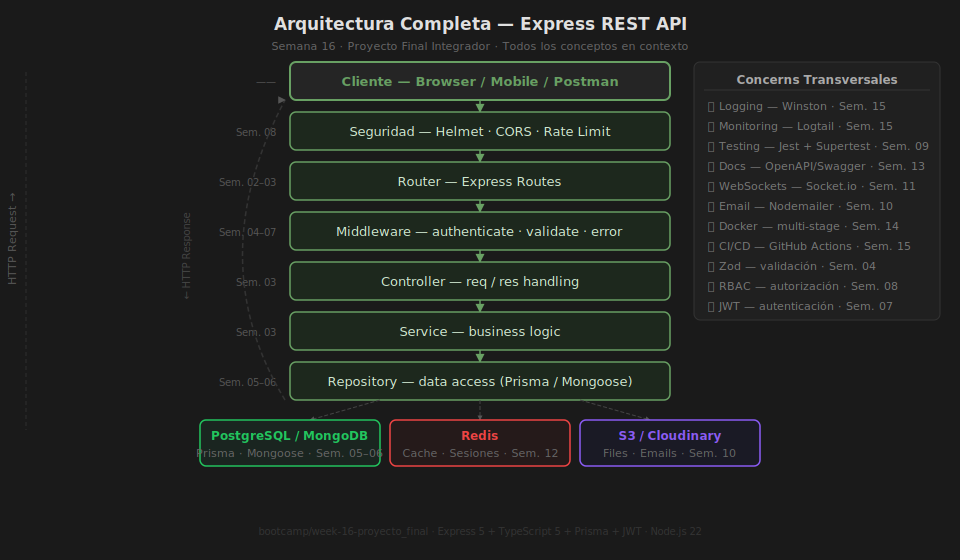

# Semana 16 — Proyecto Final Integrador

**Slug**: `proyecto_final` | **Duración**: 8 horas | **Nivel**: Avanzado — Integración de todo el bootcamp

---

## 🎯 Objetivos de Aprendizaje

Al finalizar esta semana, serás capaz de:

1. Integrar todos los conceptos del bootcamp en una API REST profesional y completa
2. Aplicar arquitectura en capas (routes → controllers → services → repositories) de forma consistente
3. Implementar autenticación segura: JWT access & refresh tokens + bcrypt + cookies HttpOnly
4. Controlar acceso mediante RBAC (roles USER/ADMIN) con middlewares de autorización
5. Validar inputs, manejar errores globalmente y generar logs estructurados con Winston
6. Escribir tests de integración con Jest + Supertest que pasen en el pipeline de CI/CD
7. Dockerizar, documentar con README profesional y desplegar la API en Railway o Render

---

## 📚 Prerequisitos

- ✅ Semanas 01–15 completadas
- ✅ Dominio asignado por el instructor (biblioteca, farmacia, gimnasio, etc.)
- ✅ Repositorio en GitHub con pipeline CI de semana 15
- ✅ Cuenta activa en Railway o Render

---

## 🗂️ Estructura de la Semana

```
week-16-proyecto_final/
├── README.md
├── rubrica-evaluacion.md
├── 0-assets/                     # Diagramas de arquitectura integrada
├── 1-teoria/                     # Revisión arquitectural y code review
├── 2-practicas/                  # Ejercicio de code review guiado
├── 3-proyecto/                   # Proyecto final integrador (starter + README)
├── 4-recursos/                   # Videos, documentación, libros
└── 5-glosario/                   # Términos clave de todo el bootcamp
```

---

## 📝 Contenidos

### Teoría (1-teoria/)

| Archivo | Tema |
|---------|------|
| [01-arquitectura-final.md](1-teoria/01-arquitectura-final.md) | Arquitectura completa: todas las capas en contexto |
| [02-code-review.md](1-teoria/02-code-review.md) | Code review: checklists, buenas prácticas, PR skills |
| [03-documentacion-portfolio.md](1-teoria/03-documentacion-portfolio.md) | README profesional, Swagger, portfolio de desarrollador |

### Prácticas (2-practicas/)

| Ejercicio | Tema |
|-----------|------|
| [ejercicio-01-code-review](2-practicas/ejercicio-01-code-review/README.md) | Revisar y corregir una API Express con problemas conocidos |

### Proyecto Final (3-proyecto/)

El [proyecto final](3-proyecto/README.md) es una **API REST completa** adaptada a
tu dominio asignado. Integra todos los conceptos del bootcamp en un proyecto
desplegado y documentado, listo para presentar como parte de tu portafolio.



---

## ⏱️ Distribución del Tiempo (8 horas)

| Actividad | Tiempo |
|-----------|--------|
| Teoría: arquitectura, code review, portfolio | 1 h |
| Ejercicio de code review guiado | 1.5 h |
| Construcción del proyecto final (auth + dominio) | 3.5 h |
| Deploy, tests CI/CD y documentación final | 2 h |

---

## 📌 Entregables

1. **Repositorio GitHub** con el proyecto final en rama `main` y estructura en capas
2. **Pipeline CI en verde** — badge de CI visible en el README del proyecto
3. **URL pública** — `GET /health` retorna `200 OK` con status de DB
4. **README profesional** — stack, arquitectura, endpoints, cómo correr en local
5. **Tests pasando en CI** — mínimo 5 assertions de integración
6. **Presentación (5 min)** — arquitectura, decisiones de diseño, demo en vivo

---

## 🏆 Criterios de Evaluación

| Área | Puntos |
|------|--------|
| Autenticación (JWT + bcrypt + cookies HttpOnly) | 15 |
| CRUD del recurso de dominio | 20 |
| Validación (Zod) + manejo de errores global | 10 |
| Autorización RBAC (2+ roles) | 10 |
| Tests de integración (5+ assertions en CI) | 15 |
| Docker + CI/CD + URL pública activa | 15 |
| Calidad de código y arquitectura en capas | 10 |
| README profesional + documentación de endpoints | 5 |
| **Total** | **100** |

---

## 🔗 Navegación

← [Semana 15 — CI/CD y Deployment](../week-15-cicd_deployment/README.md) | 🏠 [Inicio del Bootcamp](../../README.md)
